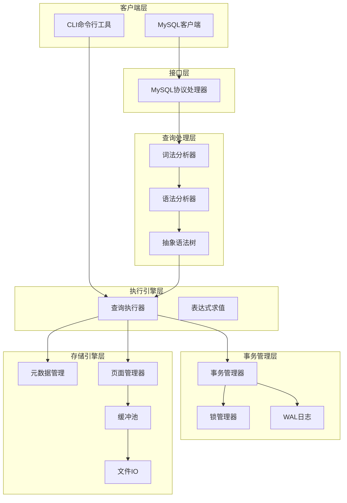

# CyscaleDB MVP 阶段实施计划

## 项目概述

使用纯C#实现一个MySQL兼容的关系型数据库系统，MVP阶段聚焦于基本的表结构定义、数据读写、事务支持、SQL解析、MySQL协议兼容和持久化存储。

## 系统架构



## 项目结构

```
CyscaleDB/
├── CyscaleDB.sln
├── src/
│   ├── CyscaleDB.Core/              # 核心库
│   │   ├── Common/                  # 公共类型、常量、工具
│   │   ├── Parsing/                 # SQL解析
│   │   │   ├── Lexer.cs
│   │   │   ├── Parser.cs
│   │   │   └── Ast/                 # AST节点定义
│   │   ├── Execution/               # 查询执行
│   │   │   ├── Executor.cs
│   │   │   ├── Operators/           # 扫描、过滤、连接等算子
│   │   │   └── Expressions/         # 表达式求值
│   │   ├── Storage/                 # 存储引擎
│   │   │   ├── Page.cs
│   │   │   ├── PageManager.cs
│   │   │   ├── BufferPool.cs
│   │   │   ├── Table.cs
│   │   │   └── Catalog.cs
│   │   ├── Transactions/            # 事务管理
│   │   │   ├── Transaction.cs
│   │   │   ├── TransactionManager.cs
│   │   │   ├── LockManager.cs
│   │   │   └── WalLog.cs
│   │   └── Protocol/                # MySQL协议
│   │       ├── MySqlServer.cs
│   │       ├── PacketReader.cs
│   │       ├── PacketWriter.cs
│   │       └── Handshake.cs
│   ├── CyscaleDB.Server/            # 数据库服务器可执行程序
│   │   └── Program.cs
│   └── CyscaleDB.Cli/               # 命令行工具
│       └── Program.cs
└── tests/
    └── CyscaleDB.Tests/             # 单元测试和集成测试
```

---

## Phase 1: 基础设施与数据类型 (1-2周)

**目标**: 搭建项目骨架，定义核心数据类型和公共组件

- 创建解决方案和项目结构
- 定义支持的数据类型枚举 (INT, BIGINT, VARCHAR, BOOLEAN, DATETIME等)
- 实现数据值的序列化/反序列化
- 定义表元数据结构 (TableSchema, ColumnDefinition)
- 实现基础错误处理和日志框架

---

## Phase 2: 存储引擎 (2-3周)

**目标**: 实现分页存储和持久化机制

- **页面管理**: 实现固定大小(4KB)页结构，包含页头、槽目录、记录区
- **文件IO**: 每表一个数据文件(.cdb)，实现页的读写操作
- **缓冲池**: 简单的LRU缓存策略管理内存中的页
- **元数据管理(Catalog)**: 
  - 存储数据库和表的元信息
  - 实现catalog.meta文件持久化
- **表操作接口**: InsertRow, ScanTable, GetRowBySlot

---

## Phase 3: SQL解析器 (2-3周)

**目标**: 手写递归下降解析器，支持SQL子集

**词法分析器**: 识别关键字、标识符、字面量、运算符

**语法分析器支持的语句**:

- `CREATE TABLE name (col1 type, col2 type, ...)`
- `DROP TABLE name`
- `INSERT INTO table (cols) VALUES (vals)`
- `SELECT cols FROM table [WHERE cond] [JOIN table ON cond]`

**AST节点**: CreateTableStmt, DropTableStmt, InsertStmt, SelectStmt, Expression, BinaryOp等

---

## Phase 4: 查询执行器 (2-3周)

**目标**: 实现基本的查询执行引擎

- **迭代器模型**: 实现Open/Next/Close接口的算子
- **基础算子**:
  - TableScanOperator: 全表扫描
  - FilterOperator: WHERE条件过滤
  - ProjectOperator: 列投影
  - NestedLoopJoinOperator: 嵌套循环连接
- **表达式求值**: 比较运算、算术运算、逻辑运算
- **DDL执行**: CREATE TABLE, DROP TABLE
- **DML执行**: INSERT, SELECT

---

## Phase 5: 事务与并发控制 (2周)

**目标**: 实现ACID事务支持

- **事务管理器**: BEGIN, COMMIT, ROLLBACK语义
- **锁管理器**: 
  - 初期实现表级锁(共享锁/排他锁)
  - 锁等待队列
- **WAL日志**: 
  - 简单的预写日志格式
  - 事务提交时刷盘
  - 启动时日志回放恢复
- **隔离级别**: 初期固定为可串行化或读已提交

---

## Phase 6: MySQL协议兼容 (2-3周)

**目标**: 实现MySQL原生协议服务端

- **TCP服务器**: 监听3306端口，接受连接
- **握手认证**: 
  - 发送Handshake包(协议版本、服务器版本、salt)
  - 接收客户端认证响应
  - 跳过密码验证(MVP阶段)
- **命令处理**:
  - COM_QUERY: 解析SQL，执行，返回结果集
  - COM_QUIT: 关闭连接
  - COM_PING: 心跳响应
- **结果集编码**: 列定义包、行数据包、EOF包、错误包

---

## Phase 7: CLI命令行工具 (1周)

**目标**: 提供本地交互式SQL终端

- 读取用户输入(支持多行SQL)
- 直接调用Core库执行SQL(不走网络协议)
- 格式化输出结果表格
- 支持退出命令(.exit, quit)
- 基本的命令历史

---

## Phase 8: 集成测试与优化 (1-2周)

**目标**: 端到端测试和问题修复

- 使用官方MySQL客户端连接测试
- 各语言MySQL Connector连接测试
- 并发事务正确性测试
- 崩溃恢复测试
- 性能基准测试(小数据量)
- Bug修复和稳定性改进

---

## 技术要点

| 模块 | 关键实现策略 |

|------|-------------|

| 页面格式 | 固定4KB，页头(16字节) + 槽目录(从后向前增长) + 记录区(从前向后增长) |

| 序列化 | 定长字段直接写入，变长字段(VARCHAR)采用长度前缀 |

| 锁管理 | Dictionary&lt;TableId, LockInfo&gt; + SemaphoreSlim实现等待 |

| WAL格式 | [TxId][Type][TableId][Data][Checksum] 二进制格式 |

| MySQL协议 | 小端字节序，3字节长度头+1字节序列号+载荷 |

---

## 风险与缓解措施

1. **SQL解析复杂度**: 采用增量开发，先支持最简单语法再逐步扩展
2. **文件损坏风险**: WAL日志 + 写入后校验和验证
3. **协议兼容性**: 使用Wireshark抓包对比，参考MySQL官方文档
4. **并发Bug**: 初期使用保守的表级锁，确保正确性优先

---

## 预计总工期

MVP阶段总计约 **12-18周**，可根据实际进度调整。建议采用敏捷迭代方式，每个Phase完成后进行阶段性测试验证。