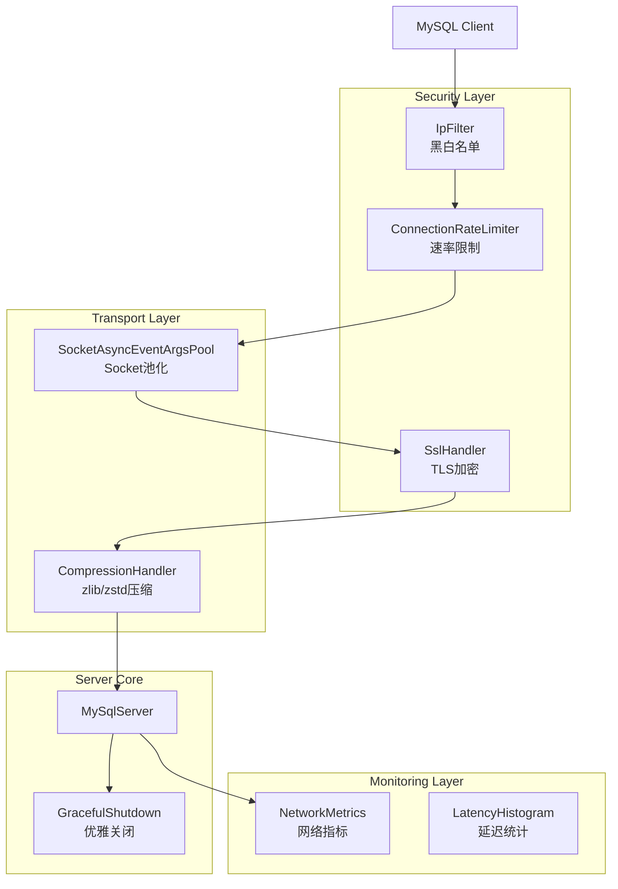
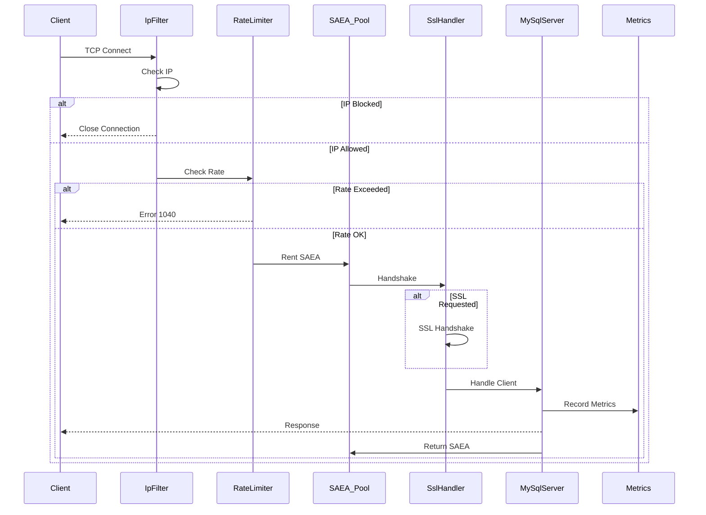

# CyscaleDB 企业级网络优化方案

## 架构概览



---

## 一、新增文件清单

| 文件路径 | 说明 |

|---------|------|

| `Protocol/Security/SslOptions.cs` | SSL/TLS 配置选项 |

| `Protocol/Security/SslHandler.cs` | SSL 握手和流处理 |

| `Protocol/Security/IpFilter.cs` | IP 黑白名单过滤器 |

| `Protocol/Security/ConnectionRateLimiter.cs` | 连接速率限制器 |

| `Protocol/Transport/SocketAsyncEventArgsPool.cs` | SAEA 对象池 |

| `Protocol/Transport/CompressionHandler.cs` | 协议压缩处理 |

| `Protocol/Monitoring/NetworkMetrics.cs` | 网络监控指标 |

| `Protocol/Monitoring/LatencyHistogram.cs` | 延迟直方图统计 |

---

## 二、详细实施计划

### 2.1 SSL/TLS 加密支持

**文件**: `Protocol/Security/SslOptions.cs`

```csharp
public class SslOptions
{
    public bool Enabled { get; set; } = false;
    public string? CertificatePath { get; set; }
    public string? CertificatePassword { get; set; }
    public SslProtocols Protocols { get; set; } = SslProtocols.Tls12 | SslProtocols.Tls13;
    public bool RequireClientCertificate { get; set; } = false;
}
```

**文件**: `Protocol/Security/SslHandler.cs`

- 在握手阶段检测 `MySqlCapabilities.Ssl`
- 发送 SSL 握手响应后切换到 `SslStream`
- 使用 `X509Certificate2` 加载证书

**修改**: [`MySqlServer.cs`](src/CyscaleDB.Core/Protocol/MySqlServer.cs)

- 在 `ServerCapabilities` 中添加 `MySqlCapabilities.Ssl`
- 在 `HandleClientAsync` 中集成 SSL 握手

### 2.2 协议压缩支持

**文件**: `Protocol/Transport/CompressionHandler.cs`

```csharp
public class CompressionHandler
{
    public byte[] Compress(ReadOnlySpan<byte> data);
    public byte[] Decompress(ReadOnlySpan<byte> compressedData);
}
```

- 支持 zlib (MySqlCapabilities.Compress)
- 支持 zstd (MySqlCapabilities.ZstdCompressionAlgorithm)
- 仅当 payload > 50 字节时压缩
- 使用 System.IO.Compression.ZLibStream 和 ZstdSharp

**NuGet 依赖**: `ZstdSharp.Port`

### 2.3 连接速率限制

**文件**: `Protocol/Security/ConnectionRateLimiter.cs`

```csharp
public class ConnectionRateLimiter
{
    private readonly ConcurrentDictionary<string, SlidingWindow> _windows;
    
    public bool TryAcquire(string clientIp);
    public void Release(string clientIp);
}

public class RateLimitOptions
{
    public int MaxConnectionsPerSecond { get; set; } = 100;
    public int MaxConnectionsPerIp { get; set; } = 50;
    public TimeSpan WindowSize { get; set; } = TimeSpan.FromSeconds(1);
}
```

### 2.4 SocketAsyncEventArgs 池化

**文件**: `Protocol/Transport/SocketAsyncEventArgsPool.cs`

```csharp
public class SocketAsyncEventArgsPool
{
    private readonly ConcurrentStack<SocketAsyncEventArgs> _pool;
    private readonly int _bufferSize;
    
    public SocketAsyncEventArgs Rent();
    public void Return(SocketAsyncEventArgs args);
}
```

- 预分配指定数量的 SAEA 对象
- 每个 SAEA 预分配缓冲区
- 减少 GC 压力

### 2.5 网络监控指标

**文件**: `Protocol/Monitoring/NetworkMetrics.cs`

```csharp
public class NetworkMetrics
{
    // 流量统计
    public long BytesReceived => _bytesReceived;
    public long BytesSent => _bytesSent;
    public long PacketsReceived => _packetsReceived;
    public long PacketsSent => _packetsSent;
    
    // 连接统计
    public int ActiveConnections { get; }
    public long TotalConnections { get; }
    public long RejectedConnections { get; }
    
    // 错误统计
    public long ProtocolErrors { get; }
    public long TimeoutErrors { get; }
    public long SslErrors { get; }
    
    // 方法
    public void RecordReceive(int bytes);
    public void RecordSend(int bytes);
    public NetworkMetricsSnapshot GetSnapshot();
}
```

**文件**: `Protocol/Monitoring/LatencyHistogram.cs`

```csharp
public class LatencyHistogram
{
    // 桶: [0-1ms, 1-5ms, 5-10ms, 10-50ms, 50-100ms, 100-500ms, 500ms+]
    private readonly long[] _buckets;
    
    public void Record(TimeSpan latency);
    public LatencyPercentiles GetPercentiles(); // p50, p90, p95, p99
}
```

### 2.6 优雅关闭机制

**修改**: [`MySqlServer.cs`](src/CyscaleDB.Core/Protocol/MySqlServer.cs)

```csharp
public async Task StopAsync(TimeSpan timeout)
{
    // 1. 停止接受新连接
    _listener.Stop();
    
    // 2. 通知所有会话即将关闭
    foreach (var session in _sessions.Values)
    {
        await NotifyShutdownAsync(session);
    }
    
    // 3. 等待现有事务完成
    var deadline = DateTime.UtcNow + timeout;
    while (_sessions.Count > 0 && DateTime.UtcNow < deadline)
    {
        await Task.Delay(100);
    }
    
    // 4. 强制关闭剩余连接
    foreach (var session in _sessions.Values)
    {
        session.Dispose();
    }
}
```

### 2.7 IP 黑白名单

**文件**: `Protocol/Security/IpFilter.cs`

```csharp
public class IpFilter
{
    private readonly HashSet<IPAddress> _whitelist;
    private readonly HashSet<IPAddress> _blacklist;
    private readonly List<IPNetwork> _whitelistNetworks;
    private readonly List<IPNetwork> _blacklistNetworks;
    
    public FilterResult Check(IPAddress address);
    public void AddToWhitelist(string ipOrCidr);
    public void AddToBlacklist(string ipOrCidr);
    public void RemoveFromWhitelist(string ipOrCidr);
    public void RemoveFromBlacklist(string ipOrCidr);
}

public enum FilterResult { Allowed, Denied, NotInList }

public class IpFilterOptions
{
    public bool Enabled { get; set; } = false;
    public FilterMode Mode { get; set; } = FilterMode.Blacklist;
    public List<string> Whitelist { get; set; } = new();
    public List<string> Blacklist { get; set; } = new();
}
```

---

## 三、配置扩展

**修改**: [`MySqlServerOptions.cs`](src/CyscaleDB.Core/Common/MySqlServerOptions.cs)

```csharp
public class MySqlServerOptions
{
    // 现有配置...
    
    #region Security Configuration
    public SslOptions Ssl { get; set; } = new();
    public IpFilterOptions IpFilter { get; set; } = new();
    public RateLimitOptions RateLimit { get; set; } = new();
    #endregion
    
    #region Compression Configuration
    public bool EnableCompression { get; set; } = false;
    public CompressionAlgorithm PreferredCompression { get; set; } = CompressionAlgorithm.Zstd;
    public int CompressionThreshold { get; set; } = 50; // 字节
    #endregion
    
    #region Advanced Configuration
    public int SocketPoolSize { get; set; } = 100;
    public TimeSpan GracefulShutdownTimeout { get; set; } = TimeSpan.FromSeconds(30);
    #endregion
}
```

---

## 四、MySqlServer 重构

**连接处理流程**:



---

## 五、NuGet 依赖

| 包名 | 版本 | 用途 |

|-----|------|-----|

| ZstdSharp.Port | latest | Zstd 压缩 |

---

## 六、目录结构

```
src/CyscaleDB.Core/Protocol/
├── Security/
│   ├── SslOptions.cs
│   ├── SslHandler.cs
│   ├── IpFilter.cs
│   └── ConnectionRateLimiter.cs
├── Transport/
│   ├── SocketAsyncEventArgsPool.cs
│   └── CompressionHandler.cs
├── Monitoring/
│   ├── NetworkMetrics.cs
│   └── LatencyHistogram.cs
├── MySqlServer.cs (修改)
├── ClientSession.cs (修改)
└── ...
```

---

## 七、兼容性保证

- 所有新功能默认禁用，不影响现有行为
- SSL 握手完全遵循 MySQL 协议规范
- 压缩格式与 MySQL 客户端兼容
- 错误码使用标准 MySQL 错误码