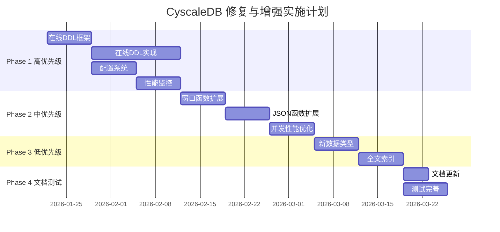

# CyscaleDB 全面修复与增强计划

## 总体目标

基于 [CODE_REVIEW_REPORT.md](d:\Code\CyscaleDB\CODE_REVIEW_REPORT.md) 的审查结果，解决所有发现的问题，将代码质量从 93.8/100 (A) 提升到 98+/100 (A+)。

## 实施时间线

**总计：8-9 周**

- Phase 1 (高优先级): 3-4 周
- Phase 2 (中优先级): 2-3 周  
- Phase 3 (低优先级): 2 周
- Phase 4 (文档与测试): 1 周

---

## Phase 1: 高优先级问题修复 (3-4 周)

### 1.1 完整实现在线 DDL (2-3 周) 🔴 最重要

**问题描述:**

当前 ALTER TABLE 实现会锁表，不支持 `ALGORITHM=INPLACE` 和 `LOCK=NONE`，影响生产环境的可用性。

**实施方案:**

#### 1.1.1 新建在线 DDL 管理器

创建 `src/CyscaleDB.Core/Storage/OnlineDdl/OnlineDdlManager.cs`:

```csharp
public sealed class OnlineDdlManager
{
    // 在线 DDL 的核心：维护临时变更日志
    private readonly Dictionary<string, DdlChangeLog> _changeLogs;
    
    // DDL 执行期间允许的并发 DML
    public bool BeginOnlineDdl(string tableName, OnlineDdlOperation operation);
    public void LogDmlChange(string tableName, DmlChange change);
    public void CommitOnlineDdl(string tableName);
    public void RollbackOnlineDdl(string tableName);
}

// DDL 变更日志，记录 DDL 期间的 DML 操作
public sealed class DdlChangeLog
{
    public List<DmlChange> Changes { get; }
    public DateTime StartTime { get; }
    public OnlineDdlOperation Operation { get; }
}

public enum OnlineDdlOperation
{
    AddColumn,
    DropColumn,
    AddIndex,
    DropIndex,
    ModifyColumn
}
```

#### 1.1.2 实现 ADD COLUMN 在线执行

修改 `src/CyscaleDB.Core/Execution/Executor.cs` 中的 `ExecuteAlterTable`:

```csharp
private ExecutionResult ExecuteAlterTable(AlterTableStatement stmt)
{
    foreach (var action in stmt.Actions)
    {
        switch (action)
        {
            case AddColumnAction addCol:
                // 支持 ALGORITHM 和 LOCK 选项
                if (stmt.Algorithm == AlterAlgorithm.Inplace && 
                    stmt.Lock == AlterLockMode.None)
                {
                    return ExecuteAddColumnOnline(stmt.TableName, addCol);
                }
                else
                {
                    return ExecuteAddColumnOffline(stmt.TableName, addCol);
                }
        }
    }
}

private ExecutionResult ExecuteAddColumnOnline(string tableName, AddColumnAction action)
{
    // 1. 开始在线 DDL
    _onlineDdlManager.BeginOnlineDdl(tableName, OnlineDdlOperation.AddColumn);
    
    try
    {
        // 2. 修改表结构元数据（只修改元数据，不复制数据）
        var schema = GetTableSchema(tableName);
        schema.AddColumn(action.ColumnDefinition);
        
        // 3. 新行写入时包含新列（默认值），旧行读取时动态添加默认值
        // 这是关键：不需要重写所有已存在的行
        
        // 4. 后台异步任务：逐步更新已存在的行（可选，提升读性能）
        Task.Run(() => BackfillColumn(tableName, action.ColumnDefinition));
        
        // 5. 应用 DDL 期间的 DML 变更
        _onlineDdlManager.CommitOnlineDdl(tableName);
        
        return ExecutionResult.Success($"Column added online");
    }
    catch
    {
        _onlineDdlManager.RollbackOnlineDdl(tableName);
        throw;
    }
}
```

#### 1.1.3 修改 Row 类支持延迟填充

修改 `src/CyscaleDB.Core/Storage/Row.cs`:

```csharp
public class Row
{
    // 新增：标记哪些列需要延迟填充
    private HashSet<int>? _lazyColumns;
    
    // 获取值时，如果是延迟列，动态填充默认值
    public DataValue GetValue(string columnName)
    {
        var index = Schema.GetColumnOrdinal(columnName);
        if (_lazyColumns?.Contains(index) == true)
        {
            // 延迟填充：返回列的默认值
            var column = Schema.Columns[index];
            return column.DefaultValue ?? DataValue.Null;
        }
        return Values[index];
    }
}
```

#### 1.1.4 实现 ADD INDEX 在线执行

```csharp
private ExecutionResult ExecuteAddIndexOnline(string tableName, AddIndexAction action)
{
    // 1. 创建影子索引（在后台构建）
    var shadowIndexPath = CreateShadowIndex(tableName, action.IndexDefinition);
    
    // 2. 扫描现有数据，逐步构建索引
    Task.Run(() => BuildIndexInBackground(tableName, action.IndexDefinition));
    
    // 3. 记录并发 DML 到索引构建日志
    _onlineDdlManager.LogDmlChange(tableName, ...);
    
    // 4. 索引构建完成后，原子切换索引
    // 5. 应用索引构建期间的 DML 变更到新索引
    
    return ExecutionResult.Success($"Index added online");
}
```

#### 1.1.5 扩展 ALTER TABLE 语法支持

修改 `src/CyscaleDB.Core/Parsing/Ast/Statements.cs`:

```csharp
public class AlterTableStatement : Statement
{
    public string TableName { get; set; }
    public List<AlterTableAction> Actions { get; set; }
    
    // 新增：在线 DDL 选项
    public AlterAlgorithm? Algorithm { get; set; }  // INPLACE, COPY, DEFAULT
    public AlterLockMode? Lock { get; set; }        // NONE, SHARED, EXCLUSIVE
}

public enum AlterAlgorithm
{
    Default,
    Inplace,
    Copy
}

public enum AlterLockMode
{
    Default,
    None,      // 允许并发读写
    Shared,    // 允许并发读
    Exclusive  // 不允许并发
}
```

修改 `src/CyscaleDB.Core/Parsing/Parser.cs` 解析这些选项:

```csharp
private AlterTableStatement ParseAlterTable()
{
    // ... 解析 ALTER TABLE table_name
    
    // 解析 ALGORITHM 子句
    if (MatchIdentifier("ALGORITHM"))
    {
        Advance();
        Expect(TokenType.Equal);
        stmt.Algorithm = ParseAlterAlgorithm();
    }
    
    // 解析 LOCK 子句
    if (Match(TokenType.LOCK))
    {
        Advance();
        Expect(TokenType.Equal);
        stmt.Lock = ParseAlterLockMode();
    }
}
```

**测试:**

- 创建 `tests/CyscaleDB.Tests/OnlineDdlTests.cs`
- 测试 ADD COLUMN 在线执行，验证并发 DML 正常
- 测试 ADD INDEX 在线构建
- 性能测试：对比在线/离线 DDL 的执行时间

---

### 1.2 配置系统 (1 周)

**问题描述:**

缺乏统一的配置管理，递归 CTE 深度、Buffer Pool 大小等硬编码在代码中。

#### 1.2.1 创建配置模型

新建 `src/CyscaleDB.Core/Common/Configuration.cs`:

```csharp
public sealed class CyscaleDbConfiguration
{
    // Buffer Pool 配置
    public int BufferPoolSizePages { get; set; } = 1024;  // 默认 16MB
    public double BufferPoolYoungRatio { get; set; } = 5.0 / 8.0;
    
    // CTE 配置
    public int RecursiveCteMaxIterations { get; set; } = 1000;
    
    // 事务配置
    public IsolationLevel DefaultIsolationLevel { get; set; } = IsolationLevel.RepeatableRead;
    
    // 锁配置
    public int LockWaitTimeoutMs { get; set; } = 5000;
    public int DeadlockCheckIntervalMs { get; set; } = 1000;
    
    // 日志配置
    public LogLevel MinimumLogLevel { get; set; } = LogLevel.Info;
    public bool EnableSlowQueryLog { get; set; } = false;
    public int SlowQueryThresholdMs { get; set; } = 1000;
    
    // 检查点配置
    public int CheckpointIntervalSeconds { get; set; } = 300;
    public int CheckpointMaxDirtyPages { get; set; } = 100;
    
    // WAL 配置
    public long WalSegmentSizeBytes { get; set; } = 16 * 1024 * 1024;  // 16MB
    public int WalBufferSizeBytes { get; set; } = 256 * 1024;  // 256KB
    
    // 在线 DDL 配置
    public bool EnableOnlineDdl { get; set; } = true;
    public int OnlineDdlMaxConcurrentOperations { get; set; } = 1;
    
    // 从配置文件加载
    public static CyscaleDbConfiguration LoadFromFile(string path);
    
    // 保存到配置文件
    public void SaveToFile(string path);
    
    // 从 JSON 加载
    public static CyscaleDbConfiguration FromJson(string json);
}
```

#### 1.2.2 创建配置文件格式

新建 `cyscaledb.config.json` 示例:

```json
{
  "bufferPool": {
    "sizePages": 1024,
    "youngRatio": 0.625
  },
  "cte": {
    "recursiveMaxIterations": 1000
  },
  "transaction": {
    "defaultIsolationLevel": "RepeatableRead",
    "lockWaitTimeoutMs": 5000
  },
  "logging": {
    "minimumLevel": "Info",
    "enableSlowQueryLog": true,
    "slowQueryThresholdMs": 1000
  },
  "checkpoint": {
    "intervalSeconds": 300,
    "maxDirtyPages": 100
  },
  "onlineDdl": {
    "enabled": true,
    "maxConcurrentOperations": 1
  }
}
```

#### 1.2.3 集成配置到现有组件

修改各组件的构造函数接受配置对象:

```csharp
// BufferPool.cs
public BufferPool(string directory, CyscaleDbConfiguration config)
{
    _capacity = config.BufferPoolSizePages;
    _youngRatio = config.BufferPoolYoungRatio;
}

// Executor.cs
private void MaterializeRecursiveCte(CteDefinition cte)
{
    int maxIterations = _configuration.RecursiveCteMaxIterations;
    // ...
}
```

#### 1.2.4 支持运行时修改部分配置

```csharp
// 支持 SET GLOBAL/SESSION 变量
public class SystemVariables
{
    private CyscaleDbConfiguration _config;
    
    public void SetGlobal(string variableName, string value)
    {
        switch (variableName.ToLower())
        {
            case "cte_max_recursion_depth":
                _config.RecursiveCteMaxIterations = int.Parse(value);
                break;
            // ...
        }
    }
}
```

**测试:**

- 创建 `tests/CyscaleDB.Tests/ConfigurationTests.cs`
- 测试从文件加载配置
- 测试运行时修改配置
- 测试配置验证（非法值拒绝）

---

### 1.3 性能监控与指标 (1 周)

**问题描述:**

缺乏性能监控，无法诊断慢查询和性能瓶颈。

#### 1.3.1 创建指标收集器

新建 `src/CyscaleDB.Core/Monitoring/Metrics.cs`:

```csharp
public sealed class MetricsCollector
{
    private static readonly MetricsCollector _instance = new();
    public static MetricsCollector Instance => _instance;
    
    // 查询指标
    public Counter QueriesExecuted { get; }
    public Histogram QueryExecutionTime { get; }
    public Counter SlowQueries { get; }
    
    // 事务指标
    public Counter TransactionsStarted { get; }
    public Counter TransactionsCommitted { get; }
    public Counter TransactionsRolledBack { get; }
    
    // 锁指标
    public Counter LockWaits { get; }
    public Histogram LockWaitTime { get; }
    public Counter Deadlocks { get; }
    
    // Buffer Pool 指标
    public Gauge BufferPoolUsedPages { get; }
    public Counter BufferPoolHits { get; }
    public Counter BufferPoolMisses { get; }
    public Gauge BufferPoolHitRatio { get; }
    
    // I/O 指标
    public Counter PagesRead { get; }
    public Counter PagesWritten { get; }
    public Histogram IoReadTime { get; }
    public Histogram IoWriteTime { get; }
    
    // 记录查询执行
    public void RecordQuery(string sql, TimeSpan duration, ExecutionPlan plan)
    {
        QueriesExecuted.Increment();
        QueryExecutionTime.Record(duration.TotalMilliseconds);
        
        if (duration.TotalMilliseconds > _config.SlowQueryThresholdMs)
        {
            SlowQueries.Increment();
            LogSlowQuery(sql, duration, plan);
        }
    }
}

// 简单的计数器实现
public class Counter
{
    private long _value;
    public long Value => Interlocked.Read(ref _value);
    public void Increment() => Interlocked.Increment(ref _value);
}

// 直方图（记录分布）
public class Histogram
{
    private readonly ConcurrentBag<double> _values;
    public void Record(double value) => _values.Add(value);
    public double P50 => CalculatePercentile(0.5);
    public double P95 => CalculatePercentile(0.95);
    public double P99 => CalculatePercentile(0.99);
}
```

#### 1.3.2 创建慢查询日志

新建 `src/CyscaleDB.Core/Monitoring/SlowQueryLog.cs`:

```csharp
public sealed class SlowQueryLog
{
    private readonly string _logFilePath;
    private readonly StreamWriter _writer;
    
    public void LogSlowQuery(string sql, TimeSpan duration, ExecutionPlan plan)
    {
        var entry = new SlowQueryEntry
        {
            Timestamp = DateTime.UtcNow,
            Sql = sql,
            DurationMs = duration.TotalMilliseconds,
            RowsExamined = plan.RowsExamined,
            RowsReturned = plan.RowsReturned,
            IndexesUsed = plan.IndexesUsed
        };
        
        WriteToLog(entry);
    }
    
    private void WriteToLog(SlowQueryEntry entry)
    {
        // 格式类似 MySQL 慢查询日志
        _writer.WriteLine($"# Time: {entry.Timestamp:yyyy-MM-dd HH:mm:ss}");
        _writer.WriteLine($"# Query_time: {entry.DurationMs:F3}  Rows_examined: {entry.RowsExamined}  Rows_returned: {entry.RowsReturned}");
        _writer.WriteLine($"# Indexes_used: {string.Join(", ", entry.IndexesUsed)}");
        _writer.WriteLine(entry.Sql);
        _writer.WriteLine();
        _writer.Flush();
    }
}
```

#### 1.3.3 添加执行计划收集

修改 `src/CyscaleDB.Core/Execution/Executor.cs`:

```csharp
public class Executor
{
    private readonly MetricsCollector _metrics = MetricsCollector.Instance;
    
    public ExecutionResult Execute(Statement stmt, Transaction? transaction)
    {
        var stopwatch = Stopwatch.StartNew();
        ExecutionPlan? plan = null;
        
        try
        {
            var result = ExecuteInternal(stmt, transaction);
            
            stopwatch.Stop();
            
            // 收集执行计划
            plan = CollectExecutionPlan(stmt, result);
            
            // 记录指标
            _metrics.RecordQuery(stmt.ToString(), stopwatch.Elapsed, plan);
            
            return result;
        }
        catch (Exception ex)
        {
            stopwatch.Stop();
            _metrics.RecordFailedQuery(stmt.ToString(), stopwatch.Elapsed, ex);
            throw;
        }
    }
    
    private ExecutionPlan CollectExecutionPlan(Statement stmt, ExecutionResult result)
    {
        return new ExecutionPlan
        {
            RowsExamined = result.RowsExamined,
            RowsReturned = result.RowCount,
            IndexesUsed = result.IndexesUsed,
            OperatorTree = result.OperatorTree
        };
    }
}
```

#### 1.3.4 添加 SHOW STATUS 命令

扩展 `ShowStatement` 支持查看指标:

```csharp
// Parser.cs
case "STATUS":
    return ParseShowStatus();

// Executor.cs
private ExecutionResult ExecuteShowStatus(ShowStatusStatement stmt)
{
    var metrics = MetricsCollector.Instance;
    
    return new ExecutionResult
    {
        Columns = new[] { "Variable_name", "Value" },
        Rows = new[]
        {
            new object[] { "Queries", metrics.QueriesExecuted.Value },
            new object[] { "Slow_queries", metrics.SlowQueries.Value },
            new object[] { "Buffer_pool_hit_ratio", metrics.BufferPoolHitRatio.Value },
            new object[] { "Deadlocks", metrics.Deadlocks.Value },
            // ...
        }
    };
}
```

**测试:**

- 创建 `tests/CyscaleDB.Tests/MetricsTests.cs`
- 测试指标收集
- 测试慢查询日志记录
- 测试 SHOW STATUS 命令

---

## Phase 2: 中优先级功能扩展 (2-3 周)

### 2.1 扩展窗口函数 (1 周)

**当前状态:** 已实现 ROW_NUMBER, RANK, DENSE_RANK, LAG, LEAD, SUM/AVG/MIN/MAX OVER

**新增函数:**

#### 2.1.1 FIRST_VALUE / LAST_VALUE

修改 `src/CyscaleDB.Core/Execution/Operators/WindowOperator.cs`:

```csharp
private DataValue ComputeFirstValue(Partition partition, int currentRow, Expression expr)
{
    // 返回分区第一行的值
    if (partition.Rows.Count == 0) return DataValue.Null;
    return EvaluateExpression(expr, partition.Rows[0]);
}

private DataValue ComputeLastValue(Partition partition, int currentRow, Expression expr)
{
    // 返回分区最后一行的值
    if (partition.Rows.Count == 0) return DataValue.Null;
    return EvaluateExpression(expr, partition.Rows[partition.Rows.Count - 1]);
}
```

#### 2.1.2 NTILE

```csharp
private DataValue ComputeNtile(Partition partition, int currentRow, int buckets)
{
    // 将分区分成 N 个桶
    int totalRows = partition.Rows.Count;
    int bucketSize = (totalRows + buckets - 1) / buckets;  // 向上取整
    int bucketNumber = (currentRow / bucketSize) + 1;
    return new DataValue(DataType.Integer, bucketNumber);
}
```

#### 2.1.3 CUME_DIST / PERCENT_RANK

```csharp
private DataValue ComputeCumeDist(Partition partition, int currentRow)
{
    // 累积分布：<= 当前行的行数 / 总行数
    int rowsUpToCurrent = currentRow + 1;
    double cumeDist = (double)rowsUpToCurrent / partition.Rows.Count;
    return new DataValue(DataType.Double, cumeDist);
}

private DataValue ComputePercentRank(Partition partition, int currentRow)
{
    // 百分比排名：(rank - 1) / (总行数 - 1)
    if (partition.Rows.Count <= 1) return new DataValue(DataType.Double, 0.0);
    
    int rank = ComputeRankValue(partition, currentRow);
    double percentRank = (double)(rank - 1) / (partition.Rows.Count - 1);
    return new DataValue(DataType.Double, percentRank);
}
```

#### 2.1.4 NTH_VALUE

```csharp
private DataValue ComputeNthValue(Partition partition, Expression expr, int n)
{
    // 返回第 N 行的值（从 1 开始）
    if (n < 1 || n > partition.Rows.Count) return DataValue.Null;
    return EvaluateExpression(expr, partition.Rows[n - 1]);
}
```

**测试:**

- 扩展 `tests/CyscaleDB.Tests/WindowFunctionTests.cs`
- 测试所有新增窗口函数
- 对比 MySQL 8.0 的结果验证正确性

---

### 2.2 扩展 JSON 函数 (1 周)

**当前状态:** 已实现 JSON_EXTRACT, JSON_SET, JSON_INSERT, JSON_ARRAY, JSON_OBJECT, ->, ->>

**新增函数:**

#### 2.2.1 JSON_CONTAINS

新建 `src/CyscaleDB.Core/Execution/JsonFunctions.cs`:

```csharp
public static bool JsonContains(string json, string candidate, string? path = null)
{
    var jsonDoc = JsonDocument.Parse(json);
    var candidateDoc = JsonDocument.Parse(candidate);
    
    JsonElement target = path != null 
        ? JsonPath.Evaluate(jsonDoc.RootElement, path) 
        : jsonDoc.RootElement;
    
    return ContainsElement(target, candidateDoc.RootElement);
}

private static bool ContainsElement(JsonElement target, JsonElement candidate)
{
    // 实现 JSON 包含逻辑
    // 对象包含：target 的所有键值对都在 candidate 中
    // 数组包含：candidate 的所有元素都在 target 中
}
```

#### 2.2.2 JSON_LENGTH

```csharp
public static int JsonLength(string json, string? path = null)
{
    var jsonDoc = JsonDocument.Parse(json);
    JsonElement element = path != null 
        ? JsonPath.Evaluate(jsonDoc.RootElement, path) 
        : jsonDoc.RootElement;
    
    return element.ValueKind switch
    {
        JsonValueKind.Array => element.GetArrayLength(),
        JsonValueKind.Object => element.EnumerateObject().Count(),
        _ => 1  // 标量值长度为 1
    };
}
```

#### 2.2.3 JSON_KEYS

```csharp
public static string JsonKeys(string json, string? path = null)
{
    var jsonDoc = JsonDocument.Parse(json);
    JsonElement element = path != null 
        ? JsonPath.Evaluate(jsonDoc.RootElement, path) 
        : jsonDoc.RootElement;
    
    if (element.ValueKind != JsonValueKind.Object)
        return "[]";
    
    var keys = element.EnumerateObject().Select(p => p.Name).ToArray();
    return JsonSerializer.Serialize(keys);
}
```

#### 2.2.4 JSON_ARRAY_APPEND / JSON_ARRAY_INSERT

```csharp
public static string JsonArrayAppend(string json, string path, string value)
{
    // 在指定路径的数组末尾追加元素
}

public static string JsonArrayInsert(string json, string path, int index, string value)
{
    // 在指定路径的数组指定位置插入元素
}
```

#### 2.2.5 JSON_MERGE_PATCH / JSON_MERGE_PRESERVE

```csharp
public static string JsonMergePatch(string json1, string json2)
{
    // RFC 7396 JSON Merge Patch
    // 递归合并，null 表示删除
}

public static string JsonMergePreserve(string json1, string json2)
{
    // 保留原有值的合并
}
```

#### 2.2.6 JSON_SEARCH

```csharp
public static string? JsonSearch(string json, string searchStr, string? path = null)
{
    // 在 JSON 文档中搜索字符串，返回路径
}
```

**测试:**

- 创建 `tests/CyscaleDB.Tests/JsonFunctionTests.cs`
- 测试所有新增 JSON 函数
- 对比 MySQL 8.0 的结果验证正确性

---

### 2.3 并发性能优化 (1 周)

#### 2.3.1 使用 ReaderWriterLockSlim 优化读多写少场景

修改 `src/CyscaleDB.Core/Storage/Catalog.cs`:

```csharp
public class Catalog
{
    // 从 object _lock 改为 ReaderWriterLockSlim
    private readonly ReaderWriterLockSlim _lock = new();
    
    public DatabaseInfo? GetDatabase(string name)
    {
        _lock.EnterReadLock();
        try
        {
            return _databases.GetValueOrDefault(name);
        }
        finally
        {
            _lock.ExitReadLock();
        }
    }
    
    public void AddDatabase(DatabaseInfo db)
    {
        _lock.EnterWriteLock();
        try
        {
            _databases[db.Name] = db;
        }
        finally
        {
            _lock.ExitWriteLock();
        }
    }
}
```

类似地优化:

- `ForeignKeyManager.cs`
- `BufferPool.cs` (部分操作)
- `TransactionManager.cs` (读取事务信息)

#### 2.3.2 优化间隙锁性能

修改 `src/CyscaleDB.Core/Transactions/LockManager.cs`:

```csharp
public class LockManager
{
    // 使用区间树优化间隙锁查找
    private readonly IntervalTree<CompositeKey, GapLock> _gapLocks;
    
    public bool HasConflictingGapLock(CompositeKey key, LockMode mode)
    {
        // O(log n) 查找冲突的间隙锁，而不是 O(n) 遍历
        var overlapping = _gapLocks.Query(key);
        return overlapping.Any(lock => lock.Mode.ConflictsWith(mode));
    }
}

// 简单的区间树实现
public class IntervalTree<TKey, TValue> where TKey : IComparable<TKey>
{
    // 实现区间树以支持快速区间查询
}
```

#### 2.3.3 缓冲池并发优化

修改 `src/CyscaleDB.Core/Storage/BufferPool.cs`:

```csharp
public class BufferPool
{
    // 分段锁：将缓冲池分成多个段，减少锁竞争
    private const int SegmentCount = 16;
    private readonly BufferPoolSegment[] _segments;
    
    private int GetSegmentIndex(int pageId) => pageId % SegmentCount;
    
    public Page GetPage(int pageId)
    {
        var segment = _segments[GetSegmentIndex(pageId)];
        return segment.GetPage(pageId);
    }
}

class BufferPoolSegment
{
    private readonly object _lock = new();
    private readonly Dictionary<int, Page> _pages;
    // ...
}
```

**测试:**

- 扩展 `tests/CyscaleDB.Tests/IntegrationTests/ConcurrentTransactionTests.cs`
- 并发性能基准测试
- 验证并发正确性

---

## Phase 3: 低优先级功能扩展 (2 周)

### 3.1 新数据类型支持 (1 周)

#### 3.1.1 ENUM 类型

新建 `src/CyscaleDB.Core/Common/EnumType.cs`:

```csharp
public sealed class EnumTypeDefinition
{
    public string Name { get; }
    public List<string> Values { get; }
    public int MaxIndex => Values.Count - 1;
    
    public DataValue Parse(string value)
    {
        int index = Values.IndexOf(value);
        if (index < 0)
            throw new ArgumentException($"Invalid ENUM value: {value}");
        return new DataValue(DataType.Enum, index);
    }
}
```

修改 `ColumnDefinition.cs` 支持 ENUM:

```csharp
public class ColumnDefinition
{
    public EnumTypeDefinition? EnumType { get; set; }
}
```

#### 3.1.2 SET 类型

```csharp
public sealed class SetTypeDefinition
{
    public string Name { get; }
    public List<string> Values { get; }
    
    public DataValue Parse(string commaSeparatedValues)
    {
        var values = commaSeparatedValues.Split(',');
        long bitmap = 0;
        
        foreach (var value in values)
        {
            int index = Values.IndexOf(value.Trim());
            if (index < 0)
                throw new ArgumentException($"Invalid SET value: {value}");
            bitmap |= (1L << index);
        }
        
        return new DataValue(DataType.Set, bitmap);
    }
}
```

#### 3.1.3 扩展时间类型

```csharp
// 支持微秒精度的 DATETIME(6), TIMESTAMP(6)
public class DataValue
{
    // 内部使用 DateTime 或 DateTimeOffset，精度到微秒
    // 序列化时保存微秒部分
}
```

**测试:**

- 创建 `tests/CyscaleDB.Tests/EnumSetTypeTests.cs`
- 测试 ENUM/SET 的 CRUD 操作
- 测试类型转换和验证

---

### 3.2 全文索引 (1 周)

#### 3.2.1 全文索引数据结构

新建 `src/CyscaleDB.Core/Storage/Index/FullTextIndex.cs`:

```csharp
public sealed class FullTextIndex : IDisposable
{
    // 倒排索引：词 -> 文档ID列表
    private readonly Dictionary<string, List<DocumentReference>> _invertedIndex;
    
    // 分词器
    private readonly ITokenizer _tokenizer;
    
    public void AddDocument(int documentId, string text)
    {
        var tokens = _tokenizer.Tokenize(text);
        foreach (var token in tokens)
        {
            if (!_invertedIndex.TryGetValue(token, out var docs))
            {
                docs = new List<DocumentReference>();
                _invertedIndex[token] = docs;
            }
            docs.Add(new DocumentReference(documentId, token.Position));
        }
    }
    
    public List<DocumentReference> Search(string query)
    {
        var queryTokens = _tokenizer.Tokenize(query);
        // 实现布尔搜索：AND, OR, NOT
        // 实现相关性排序（TF-IDF 或 BM25）
    }
}

// 简单的分词器
public interface ITokenizer
{
    IEnumerable<Token> Tokenize(string text);
}

public class SimpleTokenizer : ITokenizer
{
    public IEnumerable<Token> Tokenize(string text)
    {
        // 简单的空格分词
        // 支持停用词过滤
        // 支持词干提取
    }
}
```

#### 3.2.2 MATCH ... AGAINST 语法

修改 Parser 支持:

```csharp
// MATCH (col1, col2) AGAINST ('search text' IN NATURAL LANGUAGE MODE)
public class MatchExpression : Expression
{
    public List<string> Columns { get; set; }
    public string SearchText { get; set; }
    public MatchMode Mode { get; set; }  // NATURAL LANGUAGE, BOOLEAN, WITH QUERY EXPANSION
}
```

#### 3.2.3 执行全文搜索

```csharp
// Executor.cs
private DataValue EvaluateMatchExpression(MatchExpression expr, Row row)
{
    var ftIndex = GetFullTextIndex(expr.Columns);
    var relevanceScore = ftIndex.CalculateRelevance(row, expr.SearchText);
    return new DataValue(DataType.Double, relevanceScore);
}
```

**测试:**

- 创建 `tests/CyscaleDB.Tests/FullTextIndexTests.cs`
- 测试全文索引创建和搜索
- 测试相关性排序
- 性能测试

---

## Phase 4: 文档与测试完善 (1 周)

### 4.1 更新文档

#### 4.1.1 更新 PROJECT_STATUS.md

标记新完成的功能：

- 在线 DDL
- 配置系统
- 性能监控
- 扩展窗口函数
- 扩展 JSON 函数
- ENUM/SET 类型
- 全文索引

#### 4.1.2 创建配置文档

新建 `docs/CONFIGURATION.md`:

```markdown
# CyscaleDB 配置指南

## 配置文件格式
## 配置项详解
## 运行时配置修改
## 性能调优建议
```

#### 4.1.3 创建性能监控文档

新建 `docs/MONITORING.md`:

```markdown
# CyscaleDB 性能监控

## 指标说明
## SHOW STATUS 命令
## 慢查询日志分析
## 性能调优建议
```

#### 4.1.4 创建在线 DDL 文档

新建 `docs/ONLINE_DDL.md`:

```markdown
# CyscaleDB 在线 DDL

## 支持的操作
## ALGORITHM 和 LOCK 选项
## 使用示例
## 性能影响
## 限制和注意事项
```

---

### 4.2 完善测试

#### 4.2.1 增加测试覆盖率

- 为所有新功能添加单元测试
- 添加边界条件测试
- 添加错误处理测试

#### 4.2.2 性能回归测试

创建 `tests/CyscaleDB.Tests/IntegrationTests/PerformanceRegressionTests.cs`:

```csharp
public class PerformanceRegressionTests
{
    [Fact]
    public void OnlineDdl_AddColumn_ShouldNotBlockReads()
    {
        // 测试在线 DDL 期间并发读不受影响
    }
    
    [Fact]
    public void BufferPool_With_Concurrent_Access_Should_Maintain_Performance()
    {
        // 测试缓冲池并发性能
    }
}
```

#### 4.2.3 兼容性测试

扩展 `MySqlConnectorIntegrationTests.cs`:

- 测试新的窗口函数与 MySQL 兼容性
- 测试新的 JSON 函数与 MySQL 兼容性
- 测试在线 DDL 行为与 MySQL 兼容性

---

## 实施顺序建议



---

## 风险评估

### 高风险项

1. **在线 DDL 实现** (风险等级: 高)

   - 复杂度高，涉及并发控制
   - 缓解措施: 分步实现，先实现 ADD COLUMN，再扩展到其他操作

2. **并发性能优化** (风险等级: 中)

   - 可能引入新的并发 bug
   - 缓解措施: 充分的并发测试，逐步替换

### 中风险项

1. **配置系统** (风险等级: 中)

   - 影响现有组件
   - 缓解措施: 保持向后兼容，提供默认值

2. **性能监控** (风险等级: 低)

   - 对性能有轻微影响
   - 缓解措施: 使用异步记录，可配置开关

---

## 成功标准

完成后应达到：

1. **功能完整性**

   - 在线 DDL 支持 ADD COLUMN, DROP COLUMN, ADD INDEX (不锁表)
   - 配置系统支持所有关键参数
   - 性能监控指标齐全，慢查询日志可用
   - 窗口函数扩展到 10+ 个
   - JSON 函数扩展到 15+ 个
   - 支持 ENUM/SET 类型
   - 支持全文索引和 MATCH...AGAINST

2. **性能提升**

   - 并发查询吞吐量提升 20%+
   - 在线 DDL 执行期间 DML 性能下降 < 10%
   - 间隙锁查找时间从 O(n) 降到 O(log n)

3. **代码质量**

   - 测试覆盖率 > 85%
   - 所有新功能有完整文档
   - 代码审查评分从 93.8 提升到 98+

4. **兼容性**

   - 与 MySQL 8.0 行为一致（窗口函数、JSON 函数）
   - 通过所有兼容性测试

---

## 后续维护

完成后需要：

1. 监控生产环境性能指标
2. 收集用户反馈
3. 定期审查慢查询日志
4. 持续优化性能瓶颈
5. 根据使用情况调整默认配置

---

## 详细任务拆分（可闭环的小 Case）

为了便于实施和跟踪，将大任务拆分为可独立完成、测试和验证的小任务。每个任务都有明确的输入、输出和验收标准。

### Phase 1.1: 在线 DDL 实现（14 个小任务）

#### 1.1.1 在线 DDL 管理器框架

- **任务 1**: 创建 OnlineDdlManager 类，包含 BeginOnlineDdl、LogDmlChange、CommitOnlineDdl、RollbackOnlineDdl 方法框架
- **任务 2**: 实现 DdlChangeLog 和 DmlChange 数据结构，用于记录 DDL 期间的 DML 操作

#### 1.1.2 语法扩展

- **任务 3**: 在 Parser.cs 中扩展 ALTER TABLE 语法，解析 ALGORITHM=INPLACE/COPY 选项
- **任务 4**: 在 Parser.cs 中扩展 ALTER TABLE 语法，解析 LOCK=NONE/SHARED/EXCLUSIVE 选项
- **任务 5**: 在 Statements.cs 中为 AlterTableStatement 添加 Algorithm 和 Lock 属性

#### 1.1.3 ADD COLUMN 在线执行

- **任务 6**: 修改 Row.cs 添加 _lazyColumns 字段和延迟填充逻辑，支持动态返回默认值
- **任务 7**: 在 Executor.cs 中实现 ExecuteAddColumnOnline 方法，支持在线 ADD COLUMN（不锁表）
- **任务 8**: 实现 BackfillColumn 后台任务，逐步更新已存在行的新列值

#### 1.1.4 ADD INDEX 在线构建

- **任务 9**: 实现 CreateShadowIndex 方法，创建影子索引用于在线索引构建
- **任务 10**: 实现 BuildIndexInBackground 方法，后台扫描数据构建索引
- **任务 11**: 实现索引原子切换逻辑，将影子索引切换为正式索引并应用 DML 变更

#### 1.1.5 测试

- **任务 12**: 创建 OnlineDdlTests.cs，测试 ADD COLUMN 在线执行基本功能
- **任务 13**: 在 OnlineDdlTests.cs 中添加并发 DML 测试，验证在线 DDL 期间并发读写正常
- **任务 14**: 在 OnlineDdlTests.cs 中添加 ADD INDEX 在线构建测试

### Phase 1.2: 配置系统（11 个小任务）

#### 1.2.1 配置模型

- **任务 15**: 创建 CyscaleDbConfiguration 类，定义所有配置属性（BufferPool、CTE、事务、锁等）
- **任务 16**: 实现 FromJson 和 ToJson 方法，支持 JSON 序列化/反序列化
- **任务 17**: 实现 LoadFromFile 和 SaveToFile 方法，支持从文件加载和保存配置

#### 1.2.2 配置集成

- **任务 18**: 修改 BufferPool 构造函数接受 CyscaleDbConfiguration，使用配置的 BufferPoolSizePages 和 YoungRatio
- **任务 19**: 修改 Executor.cs 使用配置的 RecursiveCteMaxIterations 替代硬编码值
- **任务 20**: 修改 TransactionManager 使用配置的 DefaultIsolationLevel 和 LockWaitTimeoutMs
- **任务 21**: 创建 SystemVariables 类，支持 SET GLOBAL/SESSION 变量修改运行时配置

#### 1.2.3 测试

- **任务 22**: 创建 ConfigurationTests.cs，测试从文件加载配置
- **任务 23**: 在 ConfigurationTests.cs 中添加运行时修改配置的测试
- **任务 24**: 在 ConfigurationTests.cs 中添加配置验证测试（非法值拒绝）

### Phase 1.3: 性能监控（12 个小任务）

#### 1.3.1 指标收集器

- **任务 25**: 创建 Counter 类，实现线程安全的计数器（Increment、Value）
- **任务 26**: 创建 Histogram 类，实现直方图统计（Record、P50、P95、P99）
- **任务 27**: 创建 Gauge 类，实现可变的指标值（Set、Get）
- **任务 28**: 创建 MetricsCollector 单例类，包含所有指标属性（QueriesExecuted、QueryExecutionTime 等）
- **任务 29**: 实现 RecordQuery 方法，记录查询执行时间和执行计划
- **任务 30**: 在 Executor.cs 中集成 MetricsCollector，在 Execute 方法中记录查询指标

#### 1.3.2 慢查询日志

- **任务 31**: 创建 SlowQueryLog 类，实现日志文件写入功能
- **任务 32**: 实现 WriteToLog 方法，格式化慢查询日志条目（时间、SQL、执行时间、行数等）
- **任务 33**: 在 MetricsCollector.RecordQuery 中集成 SlowQueryLog，记录超过阈值的查询

#### 1.3.3 SHOW STATUS 命令

- **任务 34**: 在 Parser.cs 中添加 ParseShowStatus 方法，解析 SHOW STATUS 命令
- **任务 35**: 在 Executor.cs 中实现 ExecuteShowStatus 方法，返回所有性能指标

#### 1.3.4 测试

- **任务 36**: 创建 MetricsTests.cs，测试指标收集功能（Counter、Histogram、Gauge）
- **任务 37**: 在 MetricsTests.cs 中添加慢查询日志记录测试
- **任务 38**: 在 MetricsTests.cs 中添加 SHOW STATUS 命令测试

### Phase 2.1: 窗口函数扩展（7 个小任务）

- **任务 39**: 在 WindowOperator.cs 中实现 ComputeFirstValue 方法，返回分区第一行的值
- **任务 40**: 在 WindowOperator.cs 中实现 ComputeLastValue 方法，返回分区最后一行的值
- **任务 41**: 在 WindowOperator.cs 中实现 ComputeNtile 方法，将分区分成 N 个桶
- **任务 42**: 在 WindowOperator.cs 中实现 ComputeCumeDist 方法，计算累积分布
- **任务 43**: 在 WindowOperator.cs 中实现 ComputePercentRank 方法，计算百分比排名
- **任务 44**: 在 WindowOperator.cs 中实现 ComputeNthValue 方法，返回第 N 行的值
- **任务 45**: 扩展 WindowFunctionTests.cs，为每个新窗口函数添加测试用例

### Phase 2.2: JSON 函数扩展（7 个小任务）

- **任务 46**: 在 JsonFunctions.cs 中实现 JsonContains 方法，检查 JSON 是否包含指定值
- **任务 47**: 在 JsonFunctions.cs 中实现 JsonLength 方法，返回 JSON 数组/对象的长度
- **任务 48**: 在 JsonFunctions.cs 中实现 JsonKeys 方法，返回 JSON 对象的所有键
- **任务 49**: 在 JsonFunctions.cs 中实现 JsonSearch 方法，在 JSON 文档中搜索字符串并返回路径
- **任务 50**: 在 JsonFunctions.cs 中实现 JsonMergePatch 方法，实现 RFC 7396 JSON Merge Patch
- **任务 51**: 在 JsonFunctions.cs 中实现 JsonMergePreserve 方法，保留原有值的合并
- **任务 52**: 创建或扩展 JsonFunctionTests.cs，为每个新 JSON 函数添加测试用例

### Phase 2.3: 并发性能优化（7 个小任务）

- **任务 53**: 修改 Catalog.cs，将 object _lock 替换为 ReaderWriterLockSlim，优化读多写少场景
- **任务 54**: 修改 ForeignKeyManager.cs，使用 ReaderWriterLockSlim 优化并发访问
- **任务 55**: 创建 IntervalTree 泛型类，实现区间树数据结构用于快速区间查询
- **任务 56**: 修改 LockManager.cs，使用 IntervalTree 优化间隙锁查找（从 O(n) 降到 O(log n)）
- **任务 57**: 创建 BufferPoolSegment 类，实现分段缓冲池
- **任务 58**: 修改 BufferPool.cs，使用分段锁（16 个段）减少锁竞争
- **任务 59**: 扩展 ConcurrentTransactionTests.cs，添加并发性能基准测试

### Phase 3.1: 新数据类型（8 个小任务）

#### ENUM 类型

- **任务 60**: 创建 EnumTypeDefinition 类，定义 ENUM 类型（名称、值列表、解析方法）
- **任务 61**: 修改 ColumnDefinition.cs，添加 EnumType 属性支持 ENUM 类型
- **任务 62**: 修改 DataValue 和存储层，支持 ENUM 类型的存储和序列化

#### SET 类型

- **任务 63**: 创建 SetTypeDefinition 类，定义 SET 类型（名称、值列表、位图解析）
- **任务 64**: 修改 ColumnDefinition.cs，添加 SetType 属性支持 SET 类型
- **任务 65**: 修改 DataValue 和存储层，支持 SET 类型的存储和序列化（位图）

#### 测试

- **任务 66**: 创建 EnumSetTypeTests.cs，测试 ENUM 类型的 CRUD 操作和类型验证
- **任务 67**: 在 EnumSetTypeTests.cs 中添加 SET 类型的测试用例

### Phase 3.2: 全文索引（8 个小任务）

- **任务 68**: 创建 FullTextIndex 类，实现倒排索引数据结构（词 -> 文档ID列表）
- **任务 69**: 创建 ITokenizer 接口和 SimpleTokenizer 实现，支持文本分词
- **任务 70**: 实现 FullTextIndex.AddDocument 方法，将文档添加到倒排索引
- **任务 71**: 实现 FullTextIndex.Search 方法，支持布尔搜索和相关性排序（TF-IDF）
- **任务 72**: 在 Parser.cs 和 Statements.cs 中添加 MatchExpression，解析 MATCH...AGAINST 语法
- **任务 73**: 在 Executor.cs 中实现 EvaluateMatchExpression 方法，执行全文搜索
- **任务 74**: 创建 FullTextIndexTests.cs，测试全文索引创建和基本搜索功能
- **任务 75**: 在 FullTextIndexTests.cs 中添加相关性排序测试

### Phase 4: 文档与测试（8 个小任务）

#### 文档

- **任务 76**: 更新 PROJECT_STATUS.md，标记新完成的功能（在线 DDL、配置系统、性能监控等）
- **任务 77**: 创建 docs/CONFIGURATION.md，包含配置文件格式、配置项详解、运行时修改、性能调优建议
- **任务 78**: 创建 docs/MONITORING.md，包含指标说明、SHOW STATUS 命令、慢查询日志分析、性能调优建议
- **任务 79**: 创建 docs/ONLINE_DDL.md，包含支持的操作、ALGORITHM/LOCK 选项、使用示例、性能影响、限制和注意事项

#### 测试

- **任务 80**: 为所有新功能添加单元测试，确保边界条件和错误处理都有覆盖
- **任务 81**: 添加集成测试，验证新功能与现有系统的集成
- **任务 82**: 创建 PerformanceRegressionTests.cs，添加性能回归测试（在线 DDL、缓冲池并发等）
- **任务 83**: 扩展 MySqlConnectorIntegrationTests.cs，测试新功能与 MySQL 8.0 的兼容性

---

## 任务完成标准

每个小任务完成后应满足以下标准：

1. **代码实现**: 完成功能代码，符合代码规范
2. **单元测试**: 添加对应的单元测试，覆盖正常流程和边界情况
3. **集成验证**: 验证与现有系统的集成，确保不破坏现有功能
4. **文档更新**: 更新相关文档（如需要）
5. **代码审查**: 通过代码审查，确保代码质量

---

## 任务依赖关系

### 在线 DDL

- 任务 1-2 → 任务 3-5 → 任务 6-8 → 任务 9-11 → 任务 12-14

### 配置系统

- 任务 15-17 → 任务 18-21 → 任务 22-24

### 性能监控

- 任务 25-27 → 任务 28-30 → 任务 31-33 → 任务 34-35 → 任务 36-38

### 窗口函数

- 任务 39-44 → 任务 45（可并行实现）

### JSON 函数

- 任务 46-51 → 任务 52（可并行实现）

### 并发优化

- 任务 53-54（可并行）→ 任务 55-56 → 任务 57-58 → 任务 59

### 数据类型

- 任务 60-62 → 任务 66（ENUM）
- 任务 63-65 → 任务 67（SET）
- 可并行开发

### 全文索引

- 任务 68-69 → 任务 70-71 → 任务 72-73 → 任务 74-75