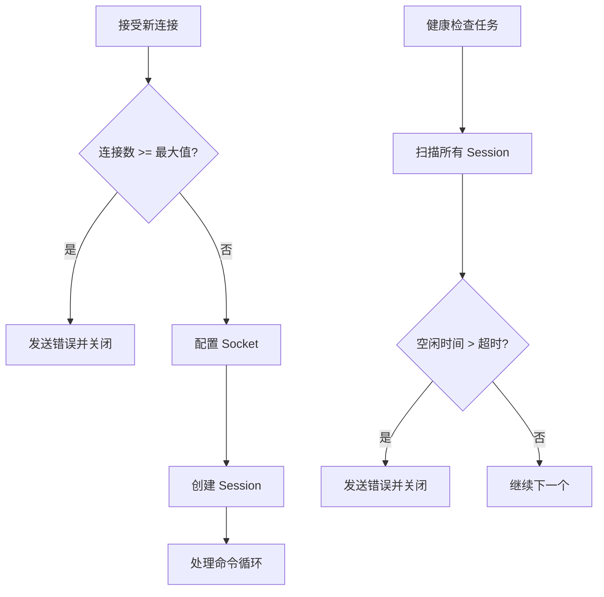
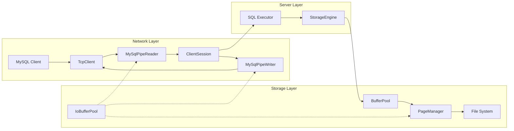

# CyscaleDB 网络与存储优化方案

## 背景分析

当前 [`MySqlServer.cs`](src/CyscaleDB.Core/Protocol/MySqlServer.cs) 和 [`StorageEngine.cs`](src/CyscaleDB.Core/Storage/StorageEngine.cs) 存在以下可优化点：

1. **MySqlServer**: 缺乏连接管理（超时、最大连接数）、Socket 未优化、PacketReader/Writer 使用传统 byte[] 方式
2. **StorageEngine**: 可增加异步 I/O、预读优化、内存池化

---

## 一、MySqlServer 网络层优化

### 1.1 添加服务端配置类

创建 [`Common/MySqlServerOptions.cs`](src/CyscaleDB.Core/Common/MySqlServerOptions.cs)：

```csharp
public class MySqlServerOptions
{
    public int Port { get; set; } = 3306;
    public string BindAddress { get; set; } = "0.0.0.0";
    
    // 连接管理
    public int MaxConnections { get; set; } = 1000;
    public TimeSpan ConnectionIdleTimeout { get; set; } = TimeSpan.FromMinutes(8);  // MySQL 默认 28800s
    public TimeSpan HealthCheckInterval { get; set; } = TimeSpan.FromSeconds(30);
    
    // Socket 配置
    public bool TcpNoDelay { get; set; } = true;
    public bool TcpKeepAlive { get; set; } = true;
    public int ReceiveBufferSize { get; set; } = 64 * 1024;
    public int SendBufferSize { get; set; } = 64 * 1024;
}
```

### 1.2 Socket 系统级优化

在 `MySqlServer` 中添加：

```csharp
private void ConfigureClientSocket(Socket socket)
{
    socket.NoDelay = _options.TcpNoDelay;
    
    if (_options.TcpKeepAlive)
    {
        socket.SetSocketOption(SocketOptionLevel.Socket, SocketOptionName.KeepAlive, true);
        socket.SetSocketOption(SocketOptionLevel.Tcp, SocketOptionName.TcpKeepAliveTime, 60);
        socket.SetSocketOption(SocketOptionLevel.Tcp, SocketOptionName.TcpKeepAliveInterval, 10);
    }
    
    socket.ReceiveBufferSize = _options.ReceiveBufferSize;
    socket.SendBufferSize = _options.SendBufferSize;
}
```

### 1.3 连接管理增强



在 `MySqlServer` 中添加：

- `ConcurrentDictionary<long, ClientSession>` 管理连接
- 后台健康检查任务，清理空闲连接
- 最大连接数限制

### 1.4 使用 System.IO.Pipelines 重构 PacketReader/PacketWriter

创建 [`Protocol/MySqlPipeReader.cs`](src/CyscaleDB.Core/Protocol/MySqlPipeReader.cs) 和 [`Protocol/MySqlPipeWriter.cs`](src/CyscaleDB.Core/Protocol/MySqlPipeWriter.cs)：

```csharp
public sealed class MySqlPipeReader
{
    private readonly PipeReader _pipeReader;
    
    public async ValueTask<byte[]> ReadPacketAsync(CancellationToken ct)
    {
        while (true)
        {
            var result = await _pipeReader.ReadAsync(ct);
            var buffer = result.Buffer;
            
            if (TryParsePacket(buffer, out var packet, out var consumed))
            {
                _pipeReader.AdvanceTo(consumed);
                return packet;
            }
            
            if (result.IsCompleted) return null;
            _pipeReader.AdvanceTo(buffer.Start, buffer.End);
        }
    }
}
```

优势：

- 零拷贝解析 MySQL 协议包
- 正确处理粘包边界（4字节头 + payload）
- 支持大于 16MB 的分包自动组装

---

## 二、StorageEngine I/O 优化

### 2.1 添加 ArrayPool 内存池化

创建 [`Common/BufferPool.cs`](src/CyscaleDB.Core/Common/BufferPool.cs)（类似 CysRedis）：

```csharp
public static class IoBufferPool
{
    public static readonly ArrayPool<byte> Shared = ArrayPool<byte>.Shared;
    
    public static readonly ArrayPool<byte> PagePool = ArrayPool<byte>.Create(
        maxArrayLength: Constants.PageSize * 4,  // 16KB
        maxArraysPerBucket: 64
    );
}
```

### 2.2 PageManager 异步 I/O 优化

在 [`Storage/PageManager.cs`](src/CyscaleDB.Core/Storage/PageManager.cs) 中添加异步方法：

```csharp
public async ValueTask<Page> ReadPageAsync(int pageId, CancellationToken ct = default)
{
    var buffer = IoBufferPool.PagePool.Rent(Constants.PageSize);
    try
    {
        var offset = (long)pageId * Constants.PageSize;
        await RandomAccess.ReadAsync(_fileHandle, buffer.AsMemory(0, Constants.PageSize), offset, ct);
        return Page.Deserialize(buffer, pageId);
    }
    finally
    {
        IoBufferPool.PagePool.Return(buffer);
    }
}
```

### 2.3 预读优化 (Read-Ahead)

在 BufferPool 中添加预读支持：

```csharp
public void PrefetchPages(PageManager pageManager, int startPageId, int count)
{
    _ = Task.Run(async () =>
    {
        for (int i = 0; i < count; i++)
        {
            var pageId = startPageId + i;
            if (!HasPage(pageManager, pageId))
            {
                await LoadPageAsync(pageManager, pageId);
            }
        }
    });
}
```

### 2.4 StorageEngine 配置类

创建 [`Common/StorageOptions.cs`](src/CyscaleDB.Core/Common/StorageOptions.cs)：

```csharp
public class StorageOptions
{
    public string DataDirectory { get; set; } = "./data";
    public int BufferPoolSizePages { get; set; } = 1024;
    
    // I/O 优化
    public bool UseDirectIo { get; set; } = false;  // O_DIRECT
    public int ReadAheadPages { get; set; } = 8;     // 预读页数
    public bool UseAsyncIo { get; set; } = true;    // 异步 I/O
    
    // 刷盘策略
    public FlushMode FlushMode { get; set; } = FlushMode.FSync;
    public int FlushIntervalMs { get; set; } = 1000;
}

public enum FlushMode { None, FSync, FDataSync }
```

---

## 三、ClientSession 增强

在 [`Protocol/ClientSession.cs`](src/CyscaleDB.Core/Protocol/ClientSession.cs) 中添加：

```csharp
public sealed class ClientSession
{
    public long Id { get; }
    public DateTime ConnectedAt { get; }
    public DateTime LastActivityAt { get; private set; }
    public TimeSpan IdleTime => DateTime.UtcNow - LastActivityAt;
    
    public void UpdateActivity() => LastActivityAt = DateTime.UtcNow;
}
```

---

## 四、文件变更清单

| 文件 | 变更类型 | 说明 |

|------|---------|------|

| `Common/MySqlServerOptions.cs` | 新增 | 服务端配置类 |

| `Common/StorageOptions.cs` | 新增 | 存储引擎配置类 |

| `Common/IoBufferPool.cs` | 新增 | I/O 内存池化 |

| `Protocol/MySqlServer.cs` | 重构 | Socket 优化、连接管理、健康检查 |

| `Protocol/MySqlPipeReader.cs` | 新增 | 基于 Pipelines 的协议解析 |

| `Protocol/MySqlPipeWriter.cs` | 新增 | 基于 Pipelines 的协议写入 |

| `Protocol/ClientSession.cs` | 新增 | 独立的会话管理类 |

| `Storage/PageManager.cs` | 增强 | 异步 I/O、内存池化 |

| `Storage/BufferPool.cs` | 增强 | 预读支持、统计信息 |

| `Storage/StorageEngine.cs` | 增强 | 配置化、统计信息 |

---

## 五、架构图



---

## 六、兼容性保证

所有优化保持 MySQL 协议完全兼容：

- 心跳使用 COM_PING 命令
- 粘包处理基于 MySQL 协议的 4 字节头边界
- 超时断开发送标准 MySQL 错误包（Error 1205 或类似）
- 可通过 SET 语句调整 wait_timeout 等参数