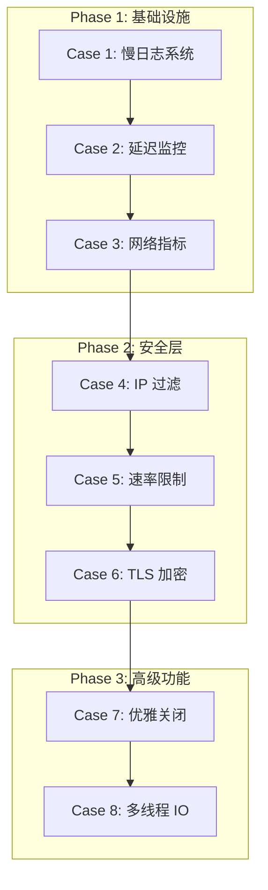
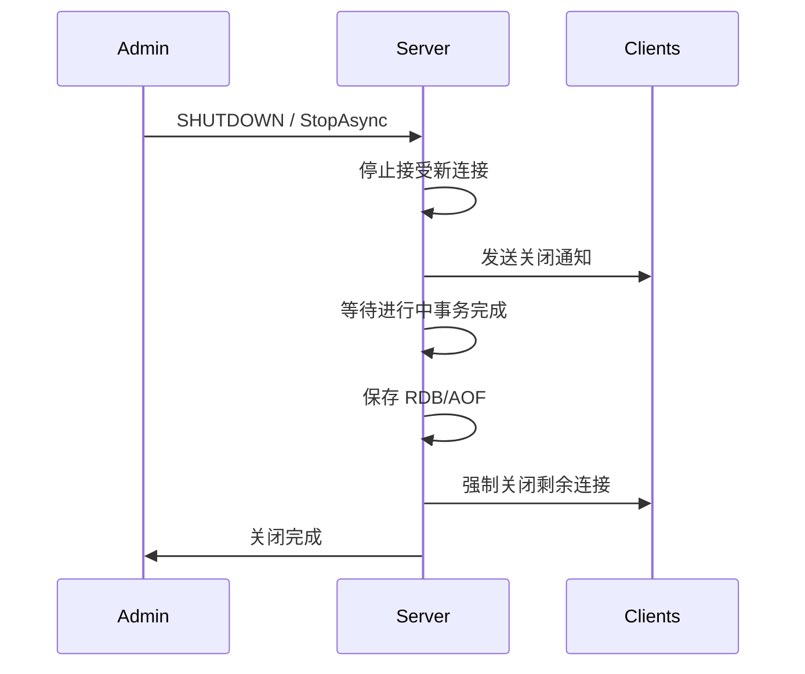
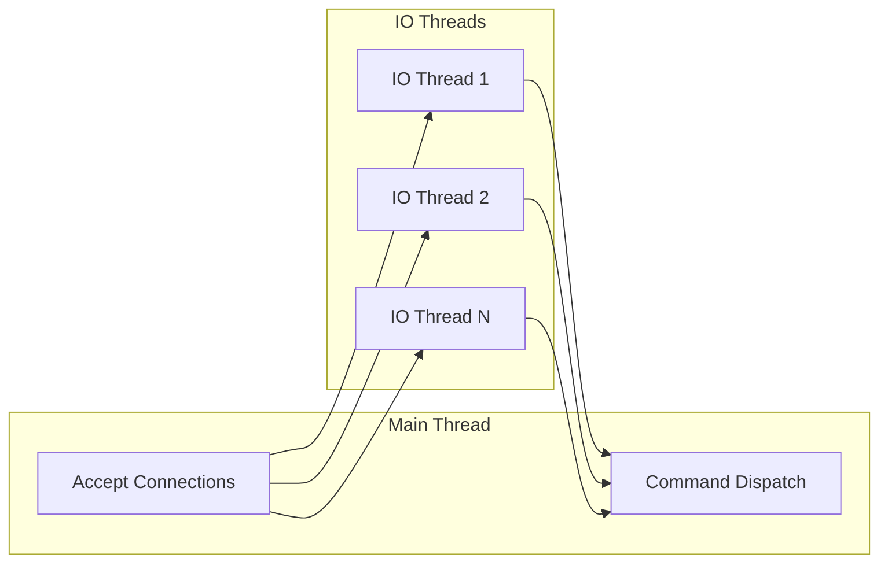

# CysRedis 企业级网络优化方案

## 架构总览



---

## Case 1: 慢日志系统

**目标**: 实现 `SLOWLOG GET/LEN/RESET` 命令

**新建文件**:

- `src/CysRedis.Core/Monitoring/SlowLog.cs` - 慢日志核心实现
- `src/CysRedis.Core/Commands/SlowLogCommands.cs` - SLOWLOG 命令处理

**修改文件**:

- `src/CysRedis.Core/Common/RedisServerOptions.cs` - 添加慢日志配置
- `src/CysRedis.Core/Commands/CommandDispatcher.cs` - 注册 SLOWLOG 命令
- `src/CysRedis.Core/Protocol/RedisServer.cs` - 集成慢日志记录

**核心数据结构**:

```csharp
public class SlowLogEntry {
    public long Id { get; }
    public DateTime Timestamp { get; }
    public TimeSpan Duration { get; }
    public string[] Arguments { get; }
    public string ClientName { get; }
    public string ClientAddress { get; }
}
```

**配置项**:

- `SlowLogThreshold` - 慢查询阈值（微秒）
- `SlowLogMaxLen` - 最大保留条目数

**验收标准**: `SLOWLOG GET 10` 返回最近 10 条慢查询

---

## Case 2: 延迟监控

**目标**: 实现 `LATENCY DOCTOR/HISTORY/LATEST/RESET` 命令

**新建文件**:

- `src/CysRedis.Core/Monitoring/LatencyMonitor.cs` - 延迟监控核心
- `src/CysRedis.Core/Monitoring/LatencyHistogram.cs` - 延迟直方图
- `src/CysRedis.Core/Commands/LatencyCommands.cs` - LATENCY 命令处理

**修改文件**:

- `src/CysRedis.Core/Common/RedisServerOptions.cs` - 添加延迟监控配置
- `src/CysRedis.Core/Commands/CommandDispatcher.cs` - 注册命令
- `src/CysRedis.Core/Protocol/RedisServer.cs` - 集成延迟采样

**事件类型**:

- `command` - 命令执行延迟
- `network` - 网络 I/O 延迟
- `fork` - 后台保存延迟

**验收标准**: `LATENCY HISTORY command` 返回命令延迟历史

---

## Case 3: 网络监控指标

**目标**: 实现网络流量和连接统计

**新建文件**:

- `src/CysRedis.Core/Monitoring/NetworkMetrics.cs` - 网络指标收集器

**修改文件**:

- `src/CysRedis.Core/Protocol/RedisServer.cs` - 集成指标记录
- `src/CysRedis.Core/Protocol/RedisClient.cs` - 记录客户端流量
- `src/CysRedis.Core/Commands/ServerCommands.cs` - 扩展 INFO 命令输出

**指标项**:

```csharp
public class NetworkMetrics {
    public long BytesReceived { get; }
    public long BytesSent { get; }
    public long PacketsReceived { get; }
    public long PacketsSent { get; }
    public int ActiveConnections { get; }
    public long TotalConnections { get; }
    public long RejectedConnections { get; }
}
```

**验收标准**: `INFO stats` 包含网络流量统计

---

## Case 4: IP 黑白名单过滤

**目标**: 实现连接级 IP 过滤

**新建文件**:

- `src/CysRedis.Core/Security/IpFilter.cs` - IP 过滤器
- `src/CysRedis.Core/Security/IpFilterOptions.cs` - 配置选项

**修改文件**:

- `src/CysRedis.Core/Common/RedisServerOptions.cs` - 添加 IP 过滤配置
- `src/CysRedis.Core/Protocol/RedisServer.cs` - 在 Accept 时检查 IP

**功能**:

- 支持单个 IP 和 CIDR 网段
- 黑名单/白名单两种模式
- 运行时动态更新

**验收标准**: 黑名单 IP 连接被拒绝，日志记录拒绝事件

---

## Case 5: 连接速率限制

**目标**: 防止连接风暴和 DDoS

**新建文件**:

- `src/CysRedis.Core/Security/RateLimiter.cs` - 速率限制器
- `src/CysRedis.Core/Security/RateLimitOptions.cs` - 配置选项

**修改文件**:

- `src/CysRedis.Core/Common/RedisServerOptions.cs` - 添加速率限制配置
- `src/CysRedis.Core/Protocol/RedisServer.cs` - 集成速率检查

**限制维度**:

- 全局每秒新连接数
- 单 IP 最大并发连接数
- 单 IP 每秒新连接数

**验收标准**: 超过限制的连接被拒绝，返回错误消息

---

## Case 6: TLS/SSL 加密支持

**目标**: 实现 Redis TLS 连接

**新建文件**:

- `src/CysRedis.Core/Security/TlsOptions.cs` - TLS 配置选项
- `src/CysRedis.Core/Security/TlsHandler.cs` - TLS 握手处理

**修改文件**:

- `src/CysRedis.Core/Common/RedisServerOptions.cs` - 添加 TLS 配置
- `src/CysRedis.Core/Protocol/RedisServer.cs` - TLS 连接处理
- `src/CysRedis.Core/Protocol/RedisClient.cs` - 支持 SslStream

**配置项**:

```csharp
public class TlsOptions {
    public bool Enabled { get; set; }
    public string CertificatePath { get; set; }
    public string CertificatePassword { get; set; }
    public SslProtocols Protocols { get; set; }
    public bool RequireClientCertificate { get; set; }
}
```

**验收标准**: redis-cli --tls 可以连接

---

## Case 7: 优雅关闭机制

**目标**: 实现平滑停机

**修改文件**:

- `src/CysRedis.Core/Protocol/RedisServer.cs` - 实现 StopAsync
- `src/CysRedis.Core/Common/RedisServerOptions.cs` - 添加关闭超时配置

**关闭流程**:



**验收标准**: 关闭时不丢失进行中的写入

---

## Case 8: 多线程 I/O

**目标**: 实现 Redis 8.x 风格的多线程 I/O

**新建文件**:

- `src/CysRedis.Core/Threading/IoThread.cs` - I/O 线程
- `src/CysRedis.Core/Threading/IoThreadPool.cs` - 线程池管理
- `src/CysRedis.Core/Threading/ClientDispatcher.cs` - 客户端分发

**修改文件**:

- `src/CysRedis.Core/Common/RedisServerOptions.cs` - 添加线程配置
- `src/CysRedis.Core/Protocol/RedisServer.cs` - 集成多线程
- `src/CysRedis.Core/Protocol/RedisClient.cs` - 线程亲和性

**架构**:



**配置项**:

- `IoThreads` - I/O 线程数（0=自动）

**验收标准**: 多线程模式下吞吐量提升 50%+

---

## 目录结构

```
src/CysRedis.Core/
├── Commands/
│   ├── SlowLogCommands.cs      [Case 1]
│   └── LatencyCommands.cs      [Case 2]
├── Monitoring/
│   ├── SlowLog.cs              [Case 1]
│   ├── LatencyMonitor.cs       [Case 2]
│   ├── LatencyHistogram.cs     [Case 2]
│   └── NetworkMetrics.cs       [Case 3]
├── Security/
│   ├── IpFilter.cs             [Case 4]
│   ├── IpFilterOptions.cs      [Case 4]
│   ├── RateLimiter.cs          [Case 5]
│   ├── RateLimitOptions.cs     [Case 5]
│   ├── TlsOptions.cs           [Case 6]
│   └── TlsHandler.cs           [Case 6]
├── Threading/
│   ├── IoThread.cs             [Case 8]
│   ├── IoThreadPool.cs         [Case 8]
│   └── ClientDispatcher.cs     [Case 8]
└── Protocol/
    ├── RedisServer.cs          [All Cases]
    └── RedisClient.cs          [Case 3,6,8]
```

---

## 实施建议

- 每个 Case 独立 PR，便于 Code Review
- Case 1-3 可并行开发（无依赖）
- Case 4-5 可并行开发（无依赖）
- Case 6 依赖基础设施就绪
- Case 7-8 是独立功能，可最后实现
- 所有新功能默认禁用，不影响现有行为