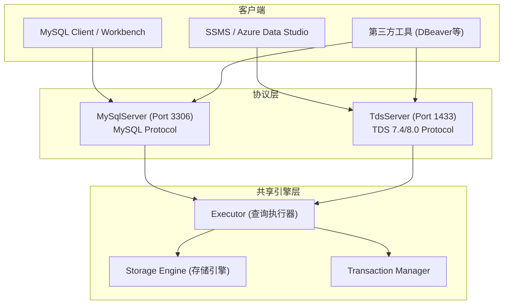

# CyscaleDB InnoDB 引擎增强 + SQL Server TDS 协议适配层

---

## 一、MySQL 8.4 InnoDB 引擎能力差距分析

根据对现有代码的深入审查，以下是 CyscaleDB 与真实 MySQL 8.4 InnoDB 引擎之间的**关键差距**（按优先级排列）：

### A. 查询执行引擎 (最高优先级 - 直接影响查询正确性和性能)

**1. 排序引擎增强**

- 当前 [OrderByOperator.cs](src/CyscaleDB.Core/Execution/Operators/OrderByOperator.cs) (150行) 采用**纯内存排序**，使用 LINQ `OrderBy` 一次性加载所有行到 `List<Row>`
- MySQL InnoDB 实现了 **External Sort (外部排序)**：当数据量超过 `sort_buffer_size` 时自动溢写到磁盘临时文件，使用多路归并排序
- 缺失：Sort buffer 管理、磁盘临时文件溢写、多路归并排序(k-way merge sort)、FileSortOperator

**2. 聚合引擎增强**

- 当前 [GroupByOperator.cs](src/CyscaleDB.Core/Execution/Operators/GroupByOperator.cs) (542行) 仅支持 **Hash Aggregation (哈希聚合)**，全部在内存 `Dictionary<string, List<Row>>` 中完成
- MySQL 支持两种策略：**Hash Aggregation** + **Sort-based Aggregation**（当数据已排序时直接流式聚合，无需全部物化）
- 缺失：Sort-based streaming aggregation、内存超限时溢写到磁盘临时表、GROUP BY WITH ROLLUP

**3. JOIN 算法增强**

- 当前仅有 [NestedLoopJoinOperator.cs](src/CyscaleDB.Core/Execution/Operators/NestedLoopJoinOperator.cs)（嵌套循环连接）
- MySQL 8.0.18+ 引入 **Hash Join**：对等值连接大幅提升性能
- 缺失：HashJoinOperator、Block Nested Loop (BNL) 优化、Batched Key Access (BKA)

**4. 查询优化器增强**

- 当前 [IndexSelector.cs](src/CyscaleDB.Core/Execution/Optimizer/IndexSelector.cs) (~442行) 仅做**索引选择**
- MySQL 有完整的 **Cost-based Optimizer (CBO)**
- 缺失的关键优化：
                                                                                                                                - **基于统计信息的代价估算**（ANALYZE TABLE 收集的直方图和基数统计）
                                                                                                                                - **JOIN 顺序优化**（目前按 SQL 书写顺序执行，未做优化）
                                                                                                                                - **子查询优化**（物化 Materialization、Semi-join 转换、EXISTS 优化）
                                                                                                                                - **谓词下推** (Index Condition Pushdown / ICP)
                                                                                                                                - **多范围读优化** (Multi-Range Read / MRR)
                                                                                                                                - **查询计划缓存** (Query Plan Cache)
                                                                                                                                - **EXPLAIN / EXPLAIN ANALYZE** 输出格式

### B. 存储引擎内核 (高优先级 - 影响性能和企业级能力)

**5. Adaptive Hash Index (AHI) - 自适应哈希索引**

- MySQL InnoDB 自动监控索引查找模式，对热点 B-Tree 页构建内存哈希索引
- 可将某些 B-Tree 索引查找从 O(log n) 降到 O(1)

**6. Change Buffer - 变更缓冲**

- MySQL InnoDB 对非唯一二级索引的 INSERT/UPDATE/DELETE，当目标页不在 Buffer Pool 时，先缓存变更，后续读取时再合并
- 大幅减少随机 I/O

**7. 表空间加密 (Data-at-Rest Encryption)**

- MySQL 8.4 支持 AES-256 透明表空间加密
- `ALTER TABLE t ENCRYPTION='Y'`

**8. 数据压缩**

- ROW_FORMAT=COMPRESSED（页面级压缩）
- 透明页面压缩（Transparent Page Compression）
- 减少磁盘空间和 I/O

**9. Instant DDL**

- `ALTER TABLE ... ALGORITHM=INSTANT`：仅修改元数据，不重建表
- MySQL 8.0.29+ 支持任意位置的 INSTANT ADD/DROP COLUMN

**10. 临时表引擎 (TempTable)**

- MySQL 8.4 使用独立的 TempTable 存储引擎处理内部临时表
- 当前 OrderBy/GroupBy 没有磁盘溢写能力

### C. 高级特性 (中优先级)

**11. 空间索引 (R-Tree) 和空间函数**

- ST_Distance, ST_Contains, ST_Within 等 GIS 函数
- SPATIAL INDEX

**12. 并行查询执行**

- 多线程扫描大表

**13. Redo Log 归档**

- 支持 `innodb_redo_log_archive_dirs` 配置

---

## 二、SQL Server 2025 TDS 协议适配层设计

### 架构设计

在现有架构基础上，增加 TDS 协议层作为**独立的协议适配器**，共享底层存储引擎和执行器：



### TDS 协议实现范围

TDS 协议基于微软公开规范 [[MS-TDS] v39.0](https://learn.microsoft.com/en-us/openspecs/windows_protocols/MS-TDS/)。

**Phase T1: TDS 核心协议栈** - 新建 `src/CyscaleDB.Core/Protocol/Tds/` 目录

- `TdsServer.cs` - TDS 协议服务器（类似 MySqlServer.cs 的架构，监听 1433 端口）
- `TdsPacketReader.cs` / `TdsPacketWriter.cs` - TDS 包读写（8字节头 + payload）
- `TdsPreLogin.cs` - PRELOGIN 握手（协议版本协商、加密选项、实例名）
- `TdsLogin7.cs` - LOGIN7 认证处理（SQL Server 认证 + Windows 认证桩）
- `TdsTokenStream.cs` - TDS Token 流编解码（COLMETADATA, ROW, DONE, ERROR, INFO, ENVCHANGE 等）
- `TdsSession.cs` - TDS 客户端会话管理

TDS 包格式：

- Header: 8 bytes (type[1] + status[1] + length[2] + SPID[2] + packetId[1] + window[1])
- Packet types: 0x01(Query), 0x02(Legacy Login), 0x03(RPC), 0x04(Response), 0x06(Attention), 0x10(LOGIN7), 0x12(PreLogin)

**Phase T2: SQL 方言转换层**

SSMS 发送的是 T-SQL 方言，需要转换为 CyscaleDB 的 MySQL 风格 SQL：

- `TsqlTranslator.cs` - T-SQL 到 MySQL-AST 的适配层
- 关键转换：`TOP N` -> `LIMIT N`、`GETDATE()` -> `NOW()`、`ISNULL()` -> `IFNULL()`、`@@VERSION` -> `VERSION()` 等
- T-SQL 方括号标识符 `[column]` -> 反引号 `` `column` ``

**Phase T3: SSMS 兼容性元数据**

SSMS 连接后会自动查询大量系统元数据。需要实现：

- `sys.databases` / `sys.tables` / `sys.columns` / `sys.objects` / `sys.types` / `sys.schemas` 等核心系统视图
- `sp_databases` / `sp_tables` / `sp_columns` / `sp_helpdb` / `sp_who` 等系统存储过程
- `@@VERSION` / `@@SERVERNAME` / `@@SPID` / `SERVERPROPERTY()` 等系统函数
- `INFORMATION_SCHEMA` 视图（已有 MySQL 版本，需适配 SQL Server 格式差异）

**Phase T4: 数据备份与还原 (SQL Server 兼容格式)**

- `BACKUP DATABASE ... TO DISK = '...'` - 生成 SQL Server 兼容格式的备份文件（.bak）
- `RESTORE DATABASE ... FROM DISK = '...'` - 从备份文件还原
- `BACKUP LOG` - 事务日志备份
- 支持 SSMS 图形化备份/还原向导（依赖 T3 的系统存储过程）

**Phase T5: 高级 TDS 特性**

- TDS 8.0 强制 TLS 加密
- RPC 请求支持（`sp_executesql` 等参数化查询）
- Bulk Insert 协议支持
- 多结果集 (Multiple Active Result Sets / MARS)
- Attention 信号（查询取消）

### 新增文件结构

```
src/CyscaleDB.Core/
├── Protocol/
│   ├── Tds/                          # 新增：TDS 协议层
│   │   ├── TdsServer.cs             # TDS 服务器主类
│   │   ├── TdsSession.cs            # TDS 会话管理
│   │   ├── TdsPacketReader.cs       # TDS 包读取
│   │   ├── TdsPacketWriter.cs       # TDS 包写入
│   │   ├── TdsPreLogin.cs           # PreLogin 握手
│   │   ├── TdsLogin7.cs             # LOGIN7 认证
│   │   ├── TdsTokenStream.cs        # Token 流编解码
│   │   ├── TdsDataTypes.cs          # TDS 数据类型映射
│   │   └── TsqlTranslator.cs        # T-SQL 方言转换
│   └── (现有 MySQL 协议文件...)
├── Execution/
│   ├── Operators/
│   │   ├── ExternalSortOperator.cs   # 新增：外部排序算子
│   │   └── HashJoinOperator.cs       # 新增：哈希连接算子
│   └── Optimizer/
│       ├── CostBasedOptimizer.cs     # 新增：基于代价的优化器
│       ├── JoinOrderOptimizer.cs     # 新增：连接顺序优化
│       └── StatisticsManager.cs      # 新增：统计信息管理
├── Storage/
│   ├── AdaptiveHashIndex.cs          # 新增：自适应哈希索引
│   ├── ChangeBuffer.cs               # 新增：变更缓冲
│   ├── TempTableEngine.cs            # 新增：临时表引擎(磁盘溢写)
│   └── Encryption/
│       └── TablespaceEncryption.cs   # 新增：表空间加密
└── SqlServer/
    ├── SysSchemaViews.cs             # 新增：SQL Server sys.* 视图
    ├── SystemProcedures.cs           # 新增：SQL Server sp_* 系统存储过程
    └── BackupRestore.cs              # 新增：SQL Server 格式备份还原
```

---

## 三、实施优先级建议

### 第一阶段：查询引擎核心增强（直接提升可用性）

1. 外部排序 (ExternalSortOperator) - 解决大数据量 ORDER BY OOM
2. Hash Join (HashJoinOperator) - 解决大表等值连接性能
3. Sort-based Aggregation + WITH ROLLUP - 增强聚合能力
4. 临时表引擎 (TempTableEngine) - 支持排序/聚合的磁盘溢写

### 第二阶段：TDS 协议核心（实现 SSMS 基本连接）

5. TDS 核心协议栈 (PreLogin + LOGIN7 + Token Stream)
6. T-SQL 方言转换层
7. SSMS 兼容性元数据 (sys. *视图 + sp_* 过程)

### 第三阶段：存储引擎增强

8. Adaptive Hash Index
9. Change Buffer
10. 表空间加密

### 第四阶段：优化器 + 高级特性

11. Cost-based Optimizer + 统计信息
12. SQL Server 格式备份还原
13. TDS 高级特性 (MARS, Bulk Insert)

### 第五阶段：千亿级数据量高效响应与内存溢出防护 (最高优先级之一)

当数据量达到上千亿行（100B+ rows, 数十TB级）时，当前架构存在以下致命问题：

**问题诊断：**

- **OrderByOperator**: 纯内存 `List<Row>` 排序，1亿行就可能 OOM
- **GroupByOperator**: `Dictionary<string, List<Row>>` 全量物化，高基数分组必然 OOM
- **NestedLoopJoinOperator**: O(N*M) 复杂度，千亿 x 千亿无法完成
- **DistinctOperator**: 内存 HashSet，大量唯一值 OOM
- **WindowOperator**: 分区数据全量物化
- **结果集发送**: 无流式发送，大结果集缓冲在内存

**解决方案分 5 个子任务：**

#### 5.1 全局内存预算管理器 (MemoryBudgetManager)

新增文件：`src/CyscaleDB.Core/Common/MemoryBudgetManager.cs`

```
核心设计：
- 全局内存池，可配置总预算（如 max_execution_memory = 2GB）
- 每个查询会话分配内存配额，按算子分配子配额
- 算子申请内存时通过 MemoryBudgetManager.TryAllocate(bytes)
- 超限时返回 false → 算子自动切换到 spill-to-disk 模式
- 支持内存压力回调（memory pressure callback），通知所有算子释放缓存
- 对应系统变量：tmp_table_size, max_heap_table_size, sort_buffer_size
```

#### 5.2 全链路流式算子改造

对所有算子进行分级改造：

| 算子 | 当前问题 | 改造方案 |

|------|----------|----------|

| TableScanOperator | 已是流式 | 增加并行分片能力 |

| IndexScanOperator | 已是流式 | 增加 Multi-Range Read 批量化 |

| FilterOperator | 已是流式 | 无需改造 |

| ProjectOperator | 已是流式 | 无需改造 |

| LimitOperator | 已是流式 | 无需改造 |

| **OrderByOperator** | **全量内存** | **ExternalSortOperator**: sort_buffer 内排序 -> 溢写到临时文件 -> k-way merge |

| **GroupByOperator** | **全量内存** | **SpillableHashAggregation**: 分桶(partition), 单桶超限溢写 -> 递归聚合 |

| **DistinctOperator** | **全量内存** | **SpillableDistinct**: 基于 hash partition + 外部去重 |

| **NestedLoopJoin** | **O(N*M)** | **GraceHashJoin**: Build 侧分桶, 单桶内存 hash join, 超限溢写 |

| **WindowOperator** | **分区全量** | 流式窗口: 对有序输入流式计算, 仅缓存当前窗口帧 |

| **UnionOperator** | 取决子查询 | 流式拉取, UNION ALL 无物化 |

| **结果集发送** | 缓冲整个结果集 | 流式发送: 每 N 行刷一次网络 buffer |

关键 spill-to-disk 设计：

```
SpillFile 抽象:
- 使用 Memory-mapped file 或 FileStream 写入临时目录
- 行序列化: 紧凑二进制格式 (column count + types + values)
- 支持按桶(partition)分文件: hash(key) % num_partitions
- 读取时使用 BufferedStream + 预读
- 查询结束自动清理临时文件
- 可配置 tmpdir 和 max_tmp_disk_usage
```

#### 5.3 并行扫描与并行查询

新增文件：`src/CyscaleDB.Core/Execution/Operators/ParallelScanOperator.cs`

```
核心设计：
- ParallelTableScanOperator: 将表的页范围分成 N 个分片
  每个分片由独立线程扫描, 结果通过 BlockingCollection<Row> 汇聚
- ParallelAggregateOperator: 每个线程独立做局部聚合(local aggregation)
  最后做全局聚合(global merge), 类似 MapReduce
- ParallelSortOperator: 每个线程排序自己的分片
  最后做 k-way merge 合并有序流
- 并行度配置: innodb_parallel_read_threads (默认4)
- Exchange 算子: 实现数据在并行管道间的重分布(repartition/broadcast)
```

#### 5.4 大规模 I/O 优化

```
针对千亿级数据的 I/O 瓶颈:
- Windows IOCP 异步 I/O: 替代当前同步 FileStream
- Direct I/O (FILE_FLAG_NO_BUFFERING): 绕过 OS 页缓存,
  避免与 Buffer Pool 双重缓存
- 大块预读 (Aggressive Read-Ahead): 顺序扫描时预读 64-256 个连续页
- Buffer Pool 动态扩缩: 根据内存压力自动调整
  innodb_buffer_pool_size 支持在线修改
- 页面压缩 I/O: 压缩后的页减少磁盘带宽需求
```

#### 5.5 Bloom Filter 与执行层优化

```
减少不必要的数据处理:
- Runtime Bloom Filter: Hash Join build 侧完成后构建 Bloom Filter,
  推送到 probe 侧的 TableScan, 提前过滤不匹配的行
  (千亿行 probe 表可能过滤掉 90%+ 的行)
- MIN/MAX 索引: 每个数据页/分区记录列的 min/max 值,
  扫描时跳过不满足条件的整个页/分区 (Zone Map / Data Skipping)
- 索引跳跃扫描 (Index Skip Scan): 复合索引前导列缺失时
  自动枚举前导列的不同值
- 分区裁剪增强: 结合运行时参数动态裁剪分区
- 延迟物化 (Late Materialization): 仅在最终需要时才读取完整行数据,
  扫描阶段只读主键+过滤列
```

### 新增文件 (第五阶段)

```
src/CyscaleDB.Core/
├── Common/
│   └── MemoryBudgetManager.cs              # 全局内存预算管理
├── Execution/
│   ├── SpillFile.cs                        # 磁盘溢写文件抽象
│   ├── Operators/
│   │   ├── ExternalSortOperator.cs         # 外部排序 (已在Phase1)
│   │   ├── SpillableHashAggOperator.cs     # 可溢写哈希聚合
│   │   ├── SpillableDistinctOperator.cs    # 可溢写去重
│   │   ├── GraceHashJoinOperator.cs        # Grace Hash Join
│   │   ├── ParallelScanOperator.cs         # 并行扫描
│   │   ├── ParallelAggregateOperator.cs    # 并行聚合
│   │   └── ExchangeOperator.cs             # 并行数据交换
│   └── Optimizer/
│       └── BloomFilterPushdown.cs          # Bloom Filter 下推
└── Storage/
    ├── ZoneMap.cs                          # MIN/MAX 页面索引
    └── AsyncPageManager.cs                 # 异步 I/O 页面管理
```

---

## 四、第六阶段：文件组与多磁盘分布式存储

### 问题分析：当前存储架构的瓶颈

当前架构是严格的 **1 Table = 1 File = 1 Disk**：

```
当前文件路径: {rootDir}/{database}/{table}.cdb
页面寻址:     (FilePath, PageId) → 单文件内的顺序偏移
```

关键代码路径（均为单文件硬编码）：

- [StorageEngine.cs](src/CyscaleDB.Core/Storage/StorageEngine.cs): `_dataDirectory` 单一根目录
- [PageManager.cs](src/CyscaleDB.Core/Storage/PageManager.cs): `_filePath` 单一文件, `GetPageOffset(pageId) = HeaderSize + pageId * PageSize`
- [BufferPool.cs](src/CyscaleDB.Core/Storage/BufferPool.cs): `BufferKey(FilePath, PageId)` 用文件路径标识
- [DatabaseInfo.cs](src/CyscaleDB.Core/Storage/DatabaseInfo.cs): `DataDirectory` 单一目录
- [Table.cs](src/CyscaleDB.Core/Storage/Table.cs): 1:1 绑定一个 `PageManager`

**瓶颈**: 单磁盘 I/O 带宽上限（HDD ~200MB/s, SSD ~3GB/s），千亿行数据（数十TB）集中在一块磁盘无法满足性能需求。

### 设计方案：文件组 (FileGroup) 架构

借鉴 SQL Server 的 FileGroup + MySQL InnoDB 的 Tablespace 设计，引入三层抽象：

```mermaid
graph TB
    subgraph logicalDB [逻辑数据库 mydb]
        FG_PRIMARY["PRIMARY 文件组\n(系统表/默认)"]
        FG_DATA["DATA 文件组\n(业务数据)"]
        FG_INDEX["INDEX 文件组\n(索引数据)"]
        FG_ARCHIVE["ARCHIVE 文件组\n(归档/只读)"]
    end

    subgraph fg_primary_files [PRIMARY 文件组的物理文件]
        F1["C:\\data\\mydb_primary.cdb\n(主数据文件)"]
    end

    subgraph fg_data_files [DATA 文件组的物理文件]
        F2["D:\\ssd1\\mydb_data01.cdb\n(NVMe SSD 1)"]
        F3["E:\\ssd2\\mydb_data02.cdb\n(NVMe SSD 2)"]
        F4["F:\\ssd3\\mydb_data03.cdb\n(NVMe SSD 3)"]
    end

    subgraph fg_index_files [INDEX 文件组的物理文件]
        F5["G:\\ssd4\\mydb_idx01.cdb\n(独立 SSD)"]
    end

    FG_PRIMARY --> F1
    FG_DATA --> F2
    FG_DATA --> F3
    FG_DATA --> F4
    FG_INDEX --> F5
end
```

### 6.1 核心数据模型

新增文件：`src/CyscaleDB.Core/Storage/FileGroup.cs`

```
/// 数据文件描述
record DataFileInfo(
    int FileId,              // 全局唯一文件ID
    string FilePath,         // 物理文件绝对路径 (可在任意磁盘)
    string FileGroupName,    // 所属文件组
    long MaxSizeBytes,       // 文件最大大小 (0=无限)
    long GrowthBytes,        // 自动增长步长 (默认64MB)
    bool IsReadOnly          // 是否只读
);

/// 文件组
record FileGroupInfo(
    string Name,             // 文件组名 (PRIMARY, DATA, INDEX...)
    bool IsDefault,          // 是否默认文件组
    bool IsReadOnly,         // 是否只读
    List<DataFileInfo> Files // 包含的数据文件列表
);

/// 数据库元数据增强
class DatabaseInfo {
    // 现有字段...
    Dictionary<string, FileGroupInfo> FileGroups; // 新增: 文件组集合
    string DefaultFileGroup;                       // 新增: 默认文件组名
}
```

### 6.2 MultiFilePageManager - 多文件页面管理器

新增文件：`src/CyscaleDB.Core/Storage/MultiFilePageManager.cs`

替代当前单文件 `PageManager`，管理文件组内多个数据文件：

```
全局页面寻址:  (FileId:16bit, PageId:32bit) → 48bit 全局页面地址
              FileId 标识哪个物理文件, PageId 标识文件内偏移

页面分配策略 (Proportional Fill):
- Round-Robin: 新页面轮流分配到文件组内的不同文件
- Proportional: 按文件剩余空间比例分配 (空间大的文件分更多)
- 保证 I/O 负载均匀分散到所有磁盘

示意:
  AllocatePage() →
    选择文件组内剩余空间最多的文件 →
    在该文件内分配新页 →
    返回 GlobalPageId(fileId, localPageId)

读取页面:
  ReadPage(globalPageId) →
    解析 fileId → 找到 DataFileInfo → 打开对应 PageManager
    读取 localPageId 的页面数据
```

### 6.3 表/索引到文件组的映射

SQL 语法支持：

```sql
-- 创建文件组
ALTER DATABASE mydb ADD FILEGROUP fg_data;
ALTER DATABASE mydb ADD FILEGROUP fg_index;

-- 向文件组添加文件 (不同磁盘路径)
ALTER DATABASE mydb ADD FILE (
    NAME = 'data01',
    FILENAME = 'D:\ssd1\mydb_data01.cdb',
    SIZE = 10GB,
    MAXSIZE = 100GB,
    FILEGROWTH = 1GB
) TO FILEGROUP fg_data;

ALTER DATABASE mydb ADD FILE (
    NAME = 'data02',
    FILENAME = 'E:\ssd2\mydb_data02.cdb',
    SIZE = 10GB
) TO FILEGROUP fg_data;

-- 表指定文件组
CREATE TABLE orders (
    id BIGINT PRIMARY KEY,
    customer_id INT,
    amount DECIMAL(10,2)
) FILEGROUP = fg_data;

-- 索引指定独立文件组
CREATE INDEX idx_customer ON orders (customer_id) FILEGROUP = fg_index;

-- 分区表不同分区映射到不同文件组 (与 PartitionManager 集成)
CREATE TABLE logs (
    id BIGINT,
    log_date DATE,
    message TEXT
) PARTITION BY RANGE (log_date) (
    PARTITION p2024 VALUES LESS THAN ('2025-01-01') FILEGROUP = fg_archive,
    PARTITION p2025 VALUES LESS THAN ('2026-01-01') FILEGROUP = fg_data,
    PARTITION p2026 VALUES LESS THAN MAXVALUE FILEGROUP = fg_data
);

-- MySQL 兼容语法 (InnoDB Tablespace)
CREATE TABLESPACE ts_data ADD DATAFILE 'D:\ssd1\ts_data01.ibd' ENGINE=InnoDB;
CREATE TABLE users (...) TABLESPACE = ts_data;
```

### 6.4 并行 I/O 策略

```
跨文件并行读写:
- 文件组内的每个物理文件有独立的 I/O 线程
- TableScan 时并行读取多个文件的页面，通过 Merge 合并结果流
- BufferPool 可按文件组分段，减少锁竞争

Striped I/O (条带化):
- 大表的连续页面交替分布在不同文件中:
  Page0→File1, Page1→File2, Page2→File3, Page3→File1, ...
- 顺序扫描时自动变成并行 I/O（不同页从不同磁盘同时读取）

Extent 分配 (区段):
- 类似 SQL Server 的 Extent (8个连续页 = 1个Extent)
- 分配时以 Extent 为单位，减少碎片
- Uniform Extent: 整个 Extent 属于同一个表
- Mixed Extent: 小表共享 Extent (节省空间)
```

### 6.5 文件组管理命令

```sql
-- 查看文件组和文件信息
SHOW FILEGROUPS;
SHOW FILES IN FILEGROUP fg_data;
SELECT * FROM sys.database_files;
SELECT * FROM sys.filegroups;

-- 文件操作
ALTER DATABASE mydb MODIFY FILE (NAME = 'data01', SIZE = 50GB);    -- 扩容
ALTER DATABASE mydb REMOVE FILE 'data02';                           -- 移除文件
ALTER DATABASE mydb MODIFY FILEGROUP fg_archive READONLY;           -- 设只读
DBCC SHRINKFILE ('data01', 10);                                     -- 收缩文件

-- 在线添加文件 (不停机扩容 I/O 带宽)
ALTER DATABASE mydb ADD FILE (
    NAME = 'data03',
    FILENAME = 'H:\new_ssd\mydb_data03.cdb',
    SIZE = 10GB
) TO FILEGROUP fg_data;

-- 文件迁移 (将文件移动到更快的磁盘)
ALTER DATABASE mydb MODIFY FILE (NAME = 'data01', FILENAME = 'I:\nvme\mydb_data01.cdb');
```

### 6.6 与现有模块的集成改造

```
需要修改的核心文件:

1. StorageEngine.cs
   - 支持多个根目录 (DataDirectories: string[])
   - OpenTable 时根据表的文件组映射选择 MultiFilePageManager

2. DatabaseInfo.cs
   - 新增 FileGroups 字典
   - 序列化/反序列化文件组元数据到 catalog.meta

3. Table.cs
   - _pageManager 改为 IPageManager 接口
   - 支持 PageManager (单文件) 和 MultiFilePageManager (多文件) 两种实现

4. BufferPool.cs
   - BufferKey 改为 (FileId, PageId) 而非 (FilePath, PageId)
   - 按文件组分段 (BufferPoolSegment per FileGroup)

5. Catalog.cs
   - CreateDatabase 时创建 PRIMARY 文件组
   - 持久化文件组配置

6. PartitionManager.cs
   - 分区到文件组的映射
   - 不同分区可以在不同物理磁盘
```

### 新增文件 (第六阶段)

```
src/CyscaleDB.Core/Storage/
├── FileGroup.cs                    # FileGroupInfo + DataFileInfo 数据模型
├── MultiFilePageManager.cs         # 多文件页面管理器 (核心)
├── IPageManager.cs                 # 页面管理器接口 (PageManager 和 Multi 共用)
├── ExtentAllocator.cs              # Extent(区段) 分配器
├── ProportionalFillAllocator.cs    # 比例填充页面分配策略
└── FileGroupIoScheduler.cs         # 文件组级并行 I/O 调度器
```