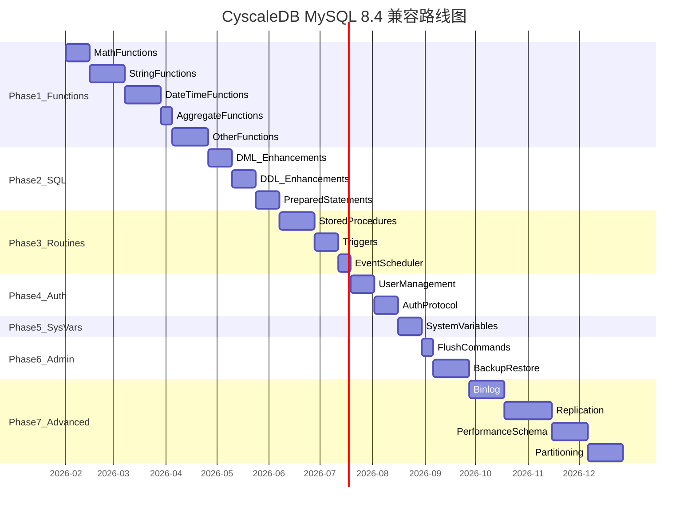

# CyscaleDB MySQL 8.4 完全兼容路线图

## 当前状态概述

CyscaleDB 已经具备了一个相当完善的 MySQL 兼容数据库的基础：

- 核心 SQL (SELECT/INSERT/UPDATE/DELETE) 已完成
- InnoDB 风格存储引擎 (MVCC, Undo Log, Buffer Pool, 行级锁) 已完成
- MySQL 协议已实现 (COM_QUERY, COM_PING 等)
- 87 个系统变量，约 60 个内置函数
- information_schema 70+ 虚拟表

**与 MySQL 8.4 的差距**：MySQL 8.4 拥有 **300+ 内置函数**、**700+ 系统变量**、完整的存储过程/触发器执行引擎、用户认证体系、备份恢复工具、复制架构、performance_schema、分区表等。

---

## Phase 1: 内置函数全覆盖 (优先级：最高)

这是实现兼容性的基石，几乎所有客户端工具和应用程序都依赖这些函数。

### 1.1 数学函数 (~25 个)

**主要修改文件**：[Executor.cs](src/CyscaleDB.Core/Execution/Executor.cs) 的 `BuildFunctionCall` 方法

缺失函数列表：

- 基础: `ABS`, `CEIL`/`CEILING`, `FLOOR`, `ROUND`, `TRUNCATE`, `MOD`, `SIGN`
- 幂/对数: `POW`/`POWER`, `SQRT`, `EXP`, `LOG`, `LOG2`, `LOG10`, `LN`
- 三角函数: `SIN`, `COS`, `TAN`, `ASIN`, `ACOS`, `ATAN`/`ATAN2`, `COT`
- 角度转换: `DEGREES`, `RADIANS`, `PI`
- 其他: `RAND`, `CRC32`, `CONV`
- 运算符: `DIV` (整数除法)

### 1.2 字符串函数 (~40 个)

缺失函数列表：

- 截取: `SUBSTRING`/`SUBSTR`/`MID`, `LEFT`, `RIGHT`, `SUBSTRING_INDEX`
- 填充/修剪: `TRIM`, `LTRIM`, `RTRIM`, `LPAD`, `RPAD`
- 替换/查找: `REPLACE`, `LOCATE`/`POSITION`, `INSTR`, `INSERT` (字符串)
- 生成: `REPEAT`, `REVERSE`, `SPACE`, `FORMAT`
- 编码: `ASCII`, `ORD`, `CHAR`, `HEX`, `UNHEX`, `BIN`, `OCT`
- Base64: `FROM_BASE64`, `TO_BASE64`
- 拼接: `CONCAT_WS` (带分隔符)
- 比较: `STRCMP`, `SOUNDEX`
- 集合: `ELT`, `FIND_IN_SET`, `EXPORT_SET`, `MAKE_SET`
- 其他: `QUOTE`, `BIT_LENGTH`, `OCTET_LENGTH`, `WEIGHT_STRING`

### 1.3 日期时间函数 (~45 个)

缺失函数列表：

- 提取: `YEAR`, `MONTH`, `DAY`/`DAYOFMONTH`, `HOUR`, `MINUTE`, `SECOND`, `MICROSECOND`
- 星期: `DAYOFWEEK`, `DAYOFYEAR`, `WEEKDAY`, `WEEK`, `WEEKOFYEAR`, `YEARWEEK`
- 名称: `QUARTER`, `MONTHNAME`, `DAYNAME`
- 类型提取: `DATE()`, `TIME()`, `EXTRACT()`
- 算术: `DATE_ADD`/`ADDDATE`, `DATE_SUB`/`SUBDATE`, `ADDTIME`, `SUBTIME`
- 差值: `DATEDIFF`, `TIMEDIFF`, `TIMESTAMPDIFF`, `PERIOD_DIFF`
- 格式化: `DATE_FORMAT`, `TIME_FORMAT`, `STR_TO_DATE`, `GET_FORMAT`
- Unix: `UNIX_TIMESTAMP`, `FROM_UNIXTIME`
- 转换: `FROM_DAYS`, `TO_DAYS`, `TO_SECONDS`, `SEC_TO_TIME`, `TIME_TO_SEC`
- 构造: `MAKEDATE`, `MAKETIME`, `TIMESTAMP()`, `TIMESTAMPADD`
- UTC: `UTC_DATE`, `UTC_TIME`, `UTC_TIMESTAMP`
- 其他: `SYSDATE`, `LOCALTIME`, `LOCALTIMESTAMP`, `LAST_DAY`, `CONVERT_TZ`, `PERIOD_ADD`

### 1.4 聚合函数扩展 (~12 个)

缺失函数列表：

- 位聚合: `BIT_AND`, `BIT_OR`, `BIT_XOR`
- 统计: `STD`/`STDDEV`/`STDDEV_POP`, `STDDEV_SAMP`, `VAR_POP`/`VARIANCE`, `VAR_SAMP`
- JSON 聚合: `JSON_ARRAYAGG`, `JSON_OBJECTAGG`
- 特殊: `COUNT(DISTINCT ...)` (多列), `GROUP_CONCAT` 增强 (ORDER BY)

### 1.5 加密/哈希函数 (~10 个)

- `MD5`, `SHA1`/`SHA`, `SHA2`
- `AES_ENCRYPT`, `AES_DECRYPT`
- `COMPRESS`, `UNCOMPRESS`, `UNCOMPRESSED_LENGTH`
- `RANDOM_BYTES`

### 1.6 控制流/比较函数补充 (~6 个)

- `NULLIF`, `GREATEST`, `LEAST`
- `INTERVAL` 函数
- `<=>` NULL-safe 等号运算符

### 1.7 正则表达式函数 (4 个)

- `REGEXP_INSTR`, `REGEXP_LIKE`, `REGEXP_REPLACE`, `REGEXP_SUBSTR`

### 1.8 类型转换函数

- `CAST(expr AS type)`, `CONVERT(expr, type)`, `CONVERT(expr USING charset)`
- `BINARY` 运算符

### 1.9 锁定函数 (5 个)

- `GET_LOCK`, `RELEASE_LOCK`, `RELEASE_ALL_LOCKS`
- `IS_FREE_LOCK`, `IS_USED_LOCK`

### 1.10 杂项函数 (~15 个)

- UUID: `UUID`, `UUID_SHORT`, `UUID_TO_BIN`, `BIN_TO_UUID`, `IS_UUID`
- 网络: `INET_ATON`, `INET_NTOA`
- 系统: `SLEEP`, `BENCHMARK`, `ANY_VALUE`, `DEFAULT`, `VALUES`
- 信息: `CHARSET`, `COERCIBILITY`, `COLLATION`, `CURRENT_ROLE`
- 位: `BIT_COUNT`
- 分组: `GROUPING`

### 1.11 JSON 函数补充 (~10 个)

- `JSON_ARRAY_APPEND`, `JSON_ARRAY_INSERT`
- `JSON_DEPTH`, `JSON_OVERLAPS`, `JSON_PRETTY`, `JSON_QUOTE`
- `JSON_SCHEMA_VALID`, `JSON_VALUE`, `JSON_TABLE`
- `JSON_STORAGE_FREE`, `JSON_STORAGE_SIZE`

### 1.12 XML 函数 (2 个)

- `ExtractValue`, `UpdateXML`

---

## Phase 2: SQL 语句完整性

### 2.1 DML 增强

**修改文件**: [Parser.cs](src/CyscaleDB.Core/Parsing/Parser.cs), [Statements.cs](src/CyscaleDB.Core/Parsing/Ast/Statements.cs), [Executor.cs](src/CyscaleDB.Core/Execution/Executor.cs)

- `REPLACE INTO` 语句
- `INSERT ... ON DUPLICATE KEY UPDATE`
- `INSERT ... SELECT`
- `UNION` / `UNION ALL` / `INTERSECT` / `EXCEPT` 完善
- 多表 `UPDATE` (UPDATE t1, t2 SET ...)
- 多表 `DELETE` (DELETE t1, t2 FROM ...)
- `SELECT ... INTO OUTFILE / DUMPFILE`
- `LOAD DATA INFILE`

### 2.2 DDL 增强

- `CREATE TEMPORARY TABLE`
- `ALTER TABLE RENAME`
- 生成列 `GENERATED ALWAYS AS (expr) [VIRTUAL|STORED]`
- `CHECK` 约束实际执行 (目前仅解析)
- `CREATE/ALTER/DROP TABLESPACE`
- `CREATE/DROP ROLE`
- `RENAME TABLE`
- 不可见索引 (`INVISIBLE`/`VISIBLE`)
- 降序索引

### 2.3 预处理语句

- `PREPARE stmt FROM 'sql'`
- `EXECUTE stmt [USING @var1, @var2]`
- `DEALLOCATE PREPARE stmt`
- COM_STMT_PREPARE / COM_STMT_EXECUTE 协议命令

---

## Phase 3: 存储过程 & 触发器执行引擎

当前状态：解析已完成，执行未实现。

### 3.1 存储过程执行

**新增文件**: `src/CyscaleDB.Core/Execution/RoutineExecutor.cs`

- 过程体语句执行 (顺序执行)
- `DECLARE` 局部变量
- `SET` 局部变量赋值
- `IF / ELSEIF / ELSE` 条件分支
- `WHILE / REPEAT / LOOP` 循环
- `LEAVE / ITERATE` 流程控制
- `IN / OUT / INOUT` 参数传递
- 过程持久化存储

### 3.2 存储函数执行

- `CREATE FUNCTION` 执行
- `RETURN` 语句
- 在 SQL 表达式中调用用户函数
- `DETERMINISTIC` / `NOT DETERMINISTIC` 标记

### 3.3 触发器执行

- `BEFORE / AFTER` 触发时机
- `INSERT / UPDATE / DELETE` 事件
- `NEW` / `OLD` 行引用
- 触发器链式调用
- 触发器持久化

### 3.4 事件调度器

- `CREATE EVENT` 执行
- 定时调度引擎
- `ALTER EVENT` / `DROP EVENT`
- `ENABLE` / `DISABLE`

### 3.5 游标支持

- `DECLARE CURSOR`
- `OPEN / FETCH / CLOSE`
- `DECLARE HANDLER` (条件处理)
- `SIGNAL / RESIGNAL`

---

## Phase 4: 用户管理与认证体系

### 4.1 用户管理实现

**修改文件**: [UserManager.cs](src/CyscaleDB.Core/Auth/UserManager.cs)

- `CREATE USER` 实际执行 (持久化到磁盘)
- `ALTER USER` (修改密码、锁定/解锁)
- `DROP USER` 实际执行
- `RENAME USER`
- 用户信息文件持久化 (`mysql.user` 等价)

### 4.2 认证协议

**修改文件**: [Handshake.cs](src/CyscaleDB.Core/Protocol/Handshake.cs)

- `mysql_native_password` 认证插件
- `caching_sha2_password` 认证插件 (MySQL 8.4 默认)
- 密码验证流程
- SSL/TLS 加密连接

### 4.3 权限系统完善

- 数据库级权限
- 表级权限
- 列级权限
- 权限检查集成到查询执行流程
- `SHOW GRANTS`

### 4.4 角色管理

- `CREATE ROLE` / `DROP ROLE`
- `GRANT role TO user`
- `SET ROLE`
- `CURRENT_ROLE()`

---

## Phase 5: 系统变量完整覆盖

### 5.1 扩展系统变量

**修改文件**: [SystemVariables.cs](src/CyscaleDB.Core/Common/SystemVariables.cs)

当前 87 个 -> 目标 500+ 个常用变量。按类别补充：

- InnoDB 变量 (~100): `innodb_buffer_pool_size`, `innodb_log_file_size`, `innodb_flush_log_at_trx_commit`, etc.
- 复制变量 (~50): `server_id`, `log_bin`, `binlog_format`, etc.
- 性能变量 (~50): `sort_buffer_size`, `join_buffer_size`, `tmp_table_size`, etc.
- 安全变量 (~30): `require_secure_transport`, `ssl_*`, etc.
- 日志变量 (~20): `general_log`, `slow_query_log`, `log_output`, etc.
- 会话变量 (~50): `group_concat_max_len`, `optimizer_switch`, etc.

### 5.2 SHOW 命令增强

- `SHOW GLOBAL/SESSION STATUS` 扩展 (MySQL 有 400+ 状态变量)
- `SHOW GRANTS [FOR user]`
- `SHOW CREATE DATABASE`
- `SHOW CREATE VIEW`
- `SHOW CREATE PROCEDURE/FUNCTION`
- `SHOW CREATE EVENT/TRIGGER`
- `SHOW PROCEDURE STATUS` / `SHOW FUNCTION STATUS`
- `SHOW TRIGGERS`
- `SHOW EVENTS`
- `SHOW MASTER STATUS` / `SHOW REPLICA STATUS`
- `SHOW BINARY LOGS`
- `SHOW OPEN TABLES`
- `SHOW PLUGINS`
- `SHOW PROFILES`

---

## Phase 6: FLUSH 命令与管理操作

### 6.1 FLUSH 命令完善

**修改文件**: [Parser.cs](src/CyscaleDB.Core/Parsing/Parser.cs), [Executor.cs](src/CyscaleDB.Core/Execution/Executor.cs)

- `FLUSH TABLES WITH READ LOCK` (实际加锁实现)
- `FLUSH BINARY LOGS`
- `FLUSH ENGINE LOGS`
- `FLUSH ERROR LOGS`
- `FLUSH GENERAL LOGS`
- `FLUSH HOSTS`
- `FLUSH OPTIMIZER_COSTS`
- `FLUSH RELAY LOGS`
- `FLUSH SLOW LOGS`
- `FLUSH USER_RESOURCES`

### 6.2 RESET 命令

- `RESET MASTER`
- `RESET REPLICA`
- `RESET QUERY CACHE`

### 6.3 KILL 命令完善

- `KILL CONNECTION id`
- `KILL QUERY id`

### 6.4 CHECK/REPAIR TABLE

- `CHECK TABLE`
- `REPAIR TABLE`
- `CHECKSUM TABLE`

---

## Phase 7: 备份与恢复

### 7.1 逻辑备份 (mysqldump 兼容)

**新增文件**: `src/CyscaleDB.Core/Backup/LogicalBackup.cs`

- `SELECT ... INTO OUTFILE` 实现
- `LOAD DATA INFILE` 实现
- 内置 dump 命令 (生成兼容 mysqldump 格式的 SQL)
- `FLUSH TABLES WITH READ LOCK` 配合一致性备份
- 按库/按表导出

### 7.2 物理备份

**新增文件**: `src/CyscaleDB.Core/Backup/PhysicalBackup.cs`

- 热备份 (利用 WAL + Checkpoint)
- 增量备份 (基于 LSN)
- 备份恢复流程
- Point-in-time Recovery (PITR)

### 7.3 备份管理命令

- `BACKUP DATABASE db TO 'path'` (CyscaleDB 扩展语法)
- `RESTORE DATABASE db FROM 'path'` (CyscaleDB 扩展语法)
- 或兼容 MySQL Enterprise Backup 接口

---

## Phase 8: 二进制日志与复制

### 8.1 Binlog 实现

**新增目录**: `src/CyscaleDB.Core/Replication/`

- Binlog 事件格式
- Row-based / Statement-based / Mixed 模式
- Binlog 文件管理
- `SHOW BINARY LOGS`
- `SHOW BINLOG EVENTS`
- `mysqlbinlog` 兼容格式

### 8.2 主从复制

- `CHANGE REPLICATION SOURCE TO`
- `START REPLICA` / `STOP REPLICA`
- IO Thread / SQL Thread
- Relay Log
- `SHOW REPLICA STATUS`
- GTID 支持

---

## Phase 9: performance_schema 与 sys 库

### 9.1 performance_schema

**新增文件**: `src/CyscaleDB.Core/Storage/PerformanceSchema/`

- 线程/连接监控表
- 语句执行统计表
- 等待事件表
- 锁监控表
- 内存使用表

### 9.2 sys 库

- 视图定义 (基于 performance_schema)
- 诊断存储过程

---

## Phase 10: 分区表

### 10.1 分区类型

**新增文件**: `src/CyscaleDB.Core/Storage/Partition/`

- `RANGE` 分区
- `LIST` 分区
- `HASH` 分区
- `KEY` 分区
- 子分区

### 10.2 分区管理

- `ALTER TABLE ... ADD/DROP/REORGANIZE PARTITION`
- 分区裁剪 (Partition Pruning)

---

## Phase 11: 高级特性

- 生成列 (VIRTUAL / STORED)
- 不可见索引 (INVISIBLE INDEX)
- 降序索引
- 函数索引
- 公共表表达式增强 (Lateral Derived Tables)
- 多值索引 (Multi-Valued Index, for JSON)
- 窗口函数 Frame 规范完善 (RANGE BETWEEN)
- 并行查询执行

---

## 实施优先级总结

---

## 关键文件修改热图

每个阶段主要涉及的核心文件：

- **[Executor.cs](src/CyscaleDB.Core/Execution/Executor.cs)**: Phase 1-6 都会大量修改 (函数实现、语句执行)
- **[Parser.cs](src/CyscaleDB.Core/Parsing/Parser.cs)**: Phase 1-3, 6 (新语法解析)
- **[Statements.cs](src/CyscaleDB.Core/Parsing/Ast/Statements.cs)**: Phase 2-3 (新 AST 节点)
- **[Expressions.cs](src/CyscaleDB.Core/Parsing/Ast/Expressions.cs)**: Phase 1 (新表达式类型如 CAST, INTERVAL)
- **[SystemVariables.cs](src/CyscaleDB.Core/Common/SystemVariables.cs)**: Phase 5
- **[UserManager.cs](src/CyscaleDB.Core/Auth/UserManager.cs)**: Phase 4
- **[MySqlServer.cs](src/CyscaleDB.Core/Protocol/MySqlServer.cs)**: Phase 2 (预处理语句协议), Phase 4 (认证)
- **新建目录**: `Backup/` (Phase 7), `Replication/` (Phase 8), `PerformanceSchema/` (Phase 9), `Partition/` (Phase 10)