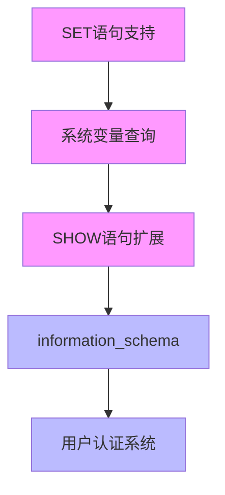

# Navicat MySQL 客户端兼容性实施计划

## 背景

当前 CyscaleDB 已完成 MVP 阶段，支持基本 CRUD 和 MySQL 协议。但要支持 Navicat 等客户端工具连接，还需要实现以下功能。

## 需要实现的功能模块

### 1. SET 语句支持（优先级：高）

Navicat 连接时会立即发送以下 SET 语句：

- `SET NAMES utf8mb4`
- `SET character_set_results = NULL`
- `SET autocommit = 1`
- `SET sql_mode = 'xxx'`
- `SET GLOBAL xxx = value` (可选支持)

**实现位置：**

- 新增 AST 节点：[`src/CyscaleDB.Core/Parsing/Ast/Statements.cs`](src/CyscaleDB.Core/Parsing/Ast/Statements.cs)
- Parser 扩展：[`src/CyscaleDB.Core/Parsing/Parser.cs`](src/CyscaleDB.Core/Parsing/Parser.cs)
- Executor 执行：[`src/CyscaleDB.Core/Execution/Executor.cs`](src/CyscaleDB.Core/Execution/Executor.cs)
```csharp
// 示例 AST 节点
public class SetStatement : Statement
{
    public SetScope Scope { get; set; } // SESSION | GLOBAL
    public List<SetVariable> Variables { get; set; } = [];
}
```


### 2. 系统变量查询（优先级：高）

支持 `@@variable_name` 语法查询系统变量：

- `SELECT @@version`
- `SELECT @@sql_mode`
- `SELECT @@character_set_client`
- `SELECT @@autocommit`

**实现位置：**

- Lexer 支持 `@@` 前缀：[`src/CyscaleDB.Core/Parsing/Lexer.cs`](src/CyscaleDB.Core/Parsing/Lexer.cs)
- 新增表达式类型：[`src/CyscaleDB.Core/Parsing/Ast/Expressions.cs`](src/CyscaleDB.Core/Parsing/Ast/Expressions.cs)
- 创建系统变量存储类：`src/CyscaleDB.Core/Common/SystemVariables.cs`

### 3. SHOW 语句扩展（优先级：高）

当前只支持 `SHOW DATABASES` 和 `SHOW TABLES`，需要扩展：

- `SHOW VARIABLES [LIKE 'pattern']`
- `SHOW STATUS [LIKE 'pattern']`
- `SHOW CREATE TABLE table_name`
- `SHOW COLUMNS FROM table_name` (同 DESCRIBE)
- `SHOW INDEX FROM table_name`
- `SHOW WARNINGS`
- `SHOW ERRORS`

**实现位置：**

- 扩展 [`src/CyscaleDB.Core/Parsing/Parser.cs`](src/CyscaleDB.Core/Parsing/Parser.cs) 中的 `ParseShowStatement`
- 新增 AST 节点到 [`src/CyscaleDB.Core/Parsing/Ast/Statements.cs`](src/CyscaleDB.Core/Parsing/Ast/Statements.cs)

### 4. information_schema 系统数据库（优先级：中）

Navicat 频繁查询 information_schema 获取元数据，最少需要支持：

- `information_schema.SCHEMATA` - 数据库列表
- `information_schema.TABLES` - 表列表
- `information_schema.COLUMNS` - 列信息
- `information_schema.STATISTICS` - 索引信息

**实现方式：**

- 在 `Catalog` 初始化时创建虚拟的 `information_schema` 数据库
- 实现虚拟表，查询时动态生成元数据

**实现位置：**

- 新建 `src/CyscaleDB.Core/Storage/InformationSchema/` 目录
- 修改 [`src/CyscaleDB.Core/Storage/Catalog.cs`](src/CyscaleDB.Core/Storage/Catalog.cs)

### 5. 用户认证系统（优先级：中）

当前认证跳过密码验证，需要实现基础认证：

- 支持 `mysql_native_password` 认证方式
- 默认用户 `root` 可配置密码
- 连接字符串格式：`Server=localhost;Port=3306;User=root;Password=xxx;Database=mydb`

**实现位置：**

- 修改 [`src/CyscaleDB.Core/Protocol/Handshake.cs`](src/CyscaleDB.Core/Protocol/Handshake.cs)
- 新建 `src/CyscaleDB.Core/Auth/UserManager.cs`
- 可选：用户信息存储在系统数据库

### 6. 其他兼容性增强（优先级：低）

- `/* comment */` 注释支持（MySQL 特有的 hint 注释）
- `KILL` 语句（终止连接）
- `START TRANSACTION` 作为 `BEGIN` 的别名

## 实施顺序建议



**阶段一（连接基础）**：SET 语句 + 系统变量 + SHOW 扩展

**阶段二（元数据）**：information_schema

**阶段三（安全）**：用户认证

## 连接字符串配置

实现后，Navicat 连接配置将为：

- 主机：`localhost` 或服务器 IP
- 端口：`3306`（默认）
- 用户名：`root`（初始阶段可任意）
- 密码：空或配置的密码
- 默认数据库：可选

## 预估工作量

| 功能模块 | 文件改动 | 复杂度 |

|---------|---------|--------|

| SET 语句 | 3 个文件 | 低 |

| 系统变量 | 4 个文件 | 中 |

| SHOW 扩展 | 3 个文件 | 中 |

| information_schema | 5+ 个文件 | 高 |

| 用户认证 | 3 个文件 | 中 |