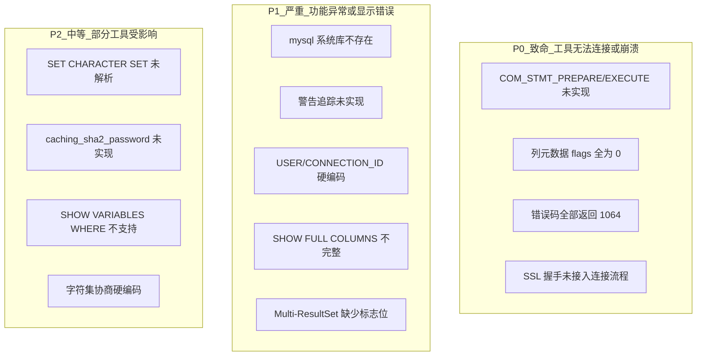
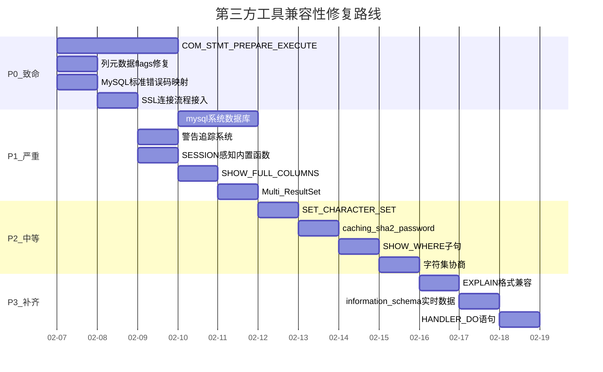

# 第三方工具兼容性优化 + 能力补齐计划

## 现状分析

通过对协议层、解析器、执行器的全面审查，发现以下影响第三方工具（Navicat/DBeaver/MySQL Workbench/JDBC/ORM）正常连接的关键缺口：

---

## P0: 致命问题（工具无法连接或直接崩溃）

### 1. 二进制协议预处理语句 (COM_STMT_*)

**问题**: JDBC Connector/J、MyBatis、Hibernate、Entity Framework、PyMySQL 默认使用二进制协议预处理语句。当前只实现了 SQL 文本级 `PREPARE/EXECUTE`，未实现 COM_STMT_PREPARE (0x16) / COM_STMT_EXECUTE (0x17) / COM_STMT_CLOSE (0x19) / COM_STMT_RESET (0x1A)。

**修改文件**: [MySqlServer.cs](src/CyscaleDB.Core/Protocol/MySqlServer.cs)

- 在命令分发 switch (line ~659-706) 中添加 COM_STMT_PREPARE / COM_STMT_EXECUTE / COM_STMT_CLOSE / COM_STMT_RESET 处理
- 实现 `HandleStmtPrepareAsync`: 解析 SQL、生成 statement_id、返回列/参数定义包
- 实现 `HandleStmtExecuteAsync`: 根据 statement_id 查找已解析 AST，绑定参数值，执行并返回结果
- 新增 `PreparedStatementStore` 类管理 session 级别的 statement_id -> AST 映射
- 关键包格式：
  - COM_STMT_PREPARE_OK: statement_id(4) + num_columns(2) + num_params(2) + warning_count(2)
  - COM_STMT_EXECUTE 参数绑定: null_bitmap + new_params_bound_flag + type(2 per param) + values

### 2. 列元数据 flags 修复

**问题**: [MySqlServer.cs](src/CyscaleDB.Core/Protocol/MySqlServer.cs) line ~927-960 中列定义包的 flags 和 decimals 全部硬编码为 0。Navicat/DBeaver 依赖这些标志来判断 NOT NULL、PRIMARY KEY、AUTO_INCREMENT、UNSIGNED 等属性。

**修改文件**: [MySqlServer.cs](src/CyscaleDB.Core/Protocol/MySqlServer.cs), [ResultSet.cs 或 ResultColumn](src/CyscaleDB.Core/Execution/)

- `ResultColumn` 增加 `Flags` (ushort) 和 `Decimals` (byte) 属性
- 在 `Executor.cs` 构建 ResultSet 时从 `ColumnDefinition` 映射标志：
  - NOT_NULL_FLAG (0x0001), PRI_KEY_FLAG (0x0002), UNIQUE_KEY_FLAG (0x0004)
  - AUTO_INCREMENT_FLAG (0x0200), UNSIGNED_FLAG (0x0020), BINARY_FLAG (0x0080)
- 在列定义包写入时使用实际的 flags 和 decimals 值

### 3. MySQL 标准错误码映射

**问题**: [MySqlServer.cs](src/CyscaleDB.Core/Protocol/MySqlServer.cs) line ~895 所有异常都发送 error_code=1064 / sqlstate="42000"，导致客户端无法区分 "表不存在" vs "语法错误" vs "重复键"。

**修改文件**: [Exceptions.cs](src/CyscaleDB.Core/Common/Exceptions.cs), [MySqlServer.cs](src/CyscaleDB.Core/Protocol/MySqlServer.cs)

- 创建 `MySqlErrorMapper` 静态类，映射 `ErrorCode` -> (mysql_error_code, sqlstate)
  - 关键映射：SyntaxError->1064/42000, TableNotFound->1146/42S02, DatabaseNotFound->1049/42000, DuplicateKey->1062/23000, ColumnNotFound->1054/42S22, AccessDenied->1045/28000
- 在 `ExecuteQueryAsync` catch 块中根据异常类型查找正确的错误码
- `CyscaleException` 增加 `SqlState` 属性

### 4. SSL/TLS 连接流程接入

**问题**: SSL capability flag 已广播，`SslHandler.cs` 已实现，但 [MySqlServer.cs](src/CyscaleDB.Core/Protocol/MySqlServer.cs) 的 `HandleClientAsync` 没有在握手后检查客户端 SSL 请求并升级连接。MySQL Workbench 默认要求 SSL。

**修改文件**: [MySqlServer.cs](src/CyscaleDB.Core/Protocol/MySqlServer.cs)

- 在发送 Handshake 包后、读取 Handshake Response 前，检查是否收到 SSL Request 包 (CLIENT_SSL flag set, 32 bytes payload)
- 如果是，调用 `SslHandler.UpgradeToSslAsync()` 升级连接
- 然后继续读取完整的 Handshake Response

---

## P1: 严重问题（功能异常或显示错误）

### 5. mysql 系统数据库

**问题**: Navicat/DBeaver 连接后会查询 `mysql.user`、`mysql.proc`、`mysql.db` 等表。当前不存在 `mysql` 库。

**新增文件**: `src/CyscaleDB.Core/Storage/MysqlSchema/MysqlSchemaProvider.cs`

- 实现虚拟表: `mysql.user`（从 UserManager 读取）、`mysql.db`、`mysql.proc`（从 Catalog 存储过程读取）、`mysql.tables_priv`、`mysql.columns_priv`
- 在 `Executor.cs` 中像 `information_schema` 一样路由 `mysql.*` 查询

### 6. 警告追踪系统

**问题**: OK 包 warning_count 永远为 0，`SHOW WARNINGS` 返回空。工具依赖此机制显示截断/类型转换警告。

**修改文件**: [ClientSession.cs](src/CyscaleDB.Core/Protocol/ClientSession.cs), [Executor.cs](src/CyscaleDB.Core/Execution/Executor.cs), [MySqlServer.cs](src/CyscaleDB.Core/Protocol/MySqlServer.cs)

- `ClientSession` 新增 `List<Warning> Warnings` + `AddWarning(level, code, message)` + `ClearWarnings()`
- `Executor` 在类型转换、截断、不精确匹配等场景调用 `AddWarning`
- `SendOkPacketAsync` 从 session 读取实际 warning count
- `ExecuteShowWarnings` 从 session 返回实际警告列表

### 7. SESSION 感知的内置函数

**问题**: `USER()`, `CURRENT_USER()`, `CONNECTION_ID()` 在 [Executor.cs](src/CyscaleDB.Core/Execution/Executor.cs) line ~5830-5838 硬编码为 "root@localhost" 和 1。

**修改文件**: [Executor.cs](src/CyscaleDB.Core/Execution/Executor.cs)

- `Executor` 构造时接收或持有 `ClientSession` 引用（当前可能已有）
- `USER()` / `CURRENT_USER()` 返回 `session.Username + "@" + session.Host`
- `CONNECTION_ID()` 返回 `session.Id`

### 8. SHOW FULL COLUMNS 完整实现

**问题**: `SHOW FULL COLUMNS FROM table` 缺少 `Collation`、`Privileges`、`Comment` 列。DBeaver 依赖此命令获取完整列信息。

**修改文件**: [Statements.cs](src/CyscaleDB.Core/Parsing/Ast/Statements.cs), [Executor.cs](src/CyscaleDB.Core/Execution/Executor.cs)

- `ShowColumnsStatement` 增加 `IsFull` 属性
- `ExecuteShowColumns` 在 Full 模式下增加 `Collation`、`Privileges`、`Comment` 三列

### 9. Multi-ResultSet 支持

**问题**: 多语句执行时只返回最后一条结果，缺少 `SERVER_MORE_RESULTS_EXISTS` (0x0008) 标志位。JDBC 驱动依赖此标志读取多结果集。

**修改文件**: [MySqlServer.cs](src/CyscaleDB.Core/Protocol/MySqlServer.cs)

- 多语句执行时，对非最后一个结果集的 OK/ResultSet 包设置 `SERVER_MORE_RESULTS_EXISTS` status flag
- 实现循环发送多个结果集

---

## P2: 中等问题（部分工具受影响）

### 10. SET CHARACTER SET 解析

**修改文件**: [Parser.cs](src/CyscaleDB.Core/Parsing/Parser.cs) ~line 2940

- 在 `ParseSetStatement` 中识别 `SET CHARACTER SET charset_name`，转换为等价的 `SetNamesStatement`

### 11. caching_sha2_password 认证

**修改文件**: [MySqlServer.cs](src/CyscaleDB.Core/Protocol/MySqlServer.cs), [UserManager.cs](src/CyscaleDB.Core/Auth/UserManager.cs)

- 实现 SHA-256 challenge-response 认证
- 支持认证插件协商（Auth Switch Request 包）

### 12. SHOW VARIABLES/STATUS WHERE 子句

**修改文件**: [Statements.cs](src/CyscaleDB.Core/Parsing/Ast/Statements.cs), [Parser.cs](src/CyscaleDB.Core/Parsing/Parser.cs), [Executor.cs](src/CyscaleDB.Core/Execution/Executor.cs)

- `ShowVariablesStatement` / `ShowStatusStatement` 增加 `Where` 表达式属性
- 解析 `SHOW VARIABLES WHERE Variable_name IN (...)` 语法
- 执行时对结果集应用 WHERE 过滤

### 13. 字符集协商

**修改文件**: [MySqlServer.cs](src/CyscaleDB.Core/Protocol/MySqlServer.cs)

- 读取 Handshake Response 中的 character_set 字段（1 byte, line ~770）
- 设置 session 对应的 character_set_client/connection/results

---

## P3: 额外能力补齐

### 14. EXPLAIN 输出格式兼容

- `EXPLAIN SELECT ...` 输出 MySQL 标准格式 (id, select_type, table, partitions, type, possible_keys, key, key_len, ref, rows, filtered, Extra)
- `EXPLAIN FORMAT=JSON` 和 `EXPLAIN ANALYZE` 支持

### 15. 更多 information_schema 表实时数据

- `INNODB_TRX` (活跃事务)
- `INNODB_LOCKS` (锁信息)
- `INNODB_LOCK_WAITS` (锁等待)
- 从实际的 TransactionManager / LockManager 读取数据

### 16. HANDLER 语句

- `HANDLER table OPEN`, `HANDLER table READ`, `HANDLER table CLOSE`
- 一些管理工具使用此低级接口快速遍历表

### 17. DO 语句

- `DO expr [, expr] ...`
- 执行表达式但不返回结果，一些工具用于心跳检测

---

## 实施优先级

