# 占位实现完整落地计划

## 问题分析

经过代码审查，发现以下功能只有框架代码，缺少核心集成：

| 功能 | 现状 | 缺失 |

|------|------|------|

| OnlineDdlManager | 类存在，但未被调用 | ExecuteAlterTable 未调用 BeginOnlineDdl/LogDmlChange |

| IntervalTree | 泛型类存在 | LockManager 未使用 |

| BufferPoolSegment | 类存在 | BufferPool 未使用分段锁 |

| FullTextIndex | 类存在 | Parser 不解析 FULLTEXT，CREATE INDEX 不支持 |

| ENUM/SET 类型 | 数据结构存在 | Parser 不解析 ENUM(...)/SET(...) |

| MetricsCollector | 类存在 | Executor 不调用 RecordQuery |

| Configuration | 类存在 | 各组件不使用配置值 |

---

## Phase 1: Online DDL 完整集成 (5个任务)

### 1.1 在 ExecuteAlterTable 中调用 OnlineDdlManager

- **文件**: [`src/CyscaleDB.Core/Execution/Executor.cs`](src/CyscaleDB.Core/Execution/Executor.cs) 第 1999 行
- **修改**:
  - 在 AddColumnAction 处理前调用 `_onlineDdlManager.BeginOnlineDdl()`
  - 完成后调用 `CommitOnlineDdl()` 或 `RollbackOnlineDdl()`
- **验证**: ALTER TABLE ADD COLUMN 时 OnlineDdlManager 被正确调用

### 1.2 在 INSERT/UPDATE/DELETE 中记录 DML 变更

- **文件**: [`src/CyscaleDB.Core/Execution/Executor.cs`](src/CyscaleDB.Core/Execution/Executor.cs)
- **修改**:
  - 在 `ExecuteInsert()` 中检查是否有 DDL 进行中，若有则调用 `LogDmlChange()`
  - 在 `ExecuteUpdate()` 和 `ExecuteDelete()` 中同样处理
- **验证**: DDL 期间的 DML 变更被正确记录

### 1.3 实现 DML 变更回放逻辑

- **文件**: [`src/CyscaleDB.Core/Execution/Executor.cs`](src/CyscaleDB.Core/Execution/Executor.cs)
- **修改**: 在 `CommitOnlineDdl()` 返回变更后，逐个应用到新表结构
- **验证**: DDL 期间的 INSERT 数据在 DDL 完成后可查询

### 1.4 添加 ALGORITHM/LOCK 解析支持

- **文件**: [`src/CyscaleDB.Core/Parsing/Parser.cs`](src/CyscaleDB.Core/Parsing/Parser.cs)
- **修改**: 在 `ParseAlterTable()` 中解析 `ALGORITHM=INPLACE` 和 `LOCK=NONE`
- **验证**: `ALTER TABLE t ADD COLUMN c INT, ALGORITHM=INPLACE, LOCK=NONE` 可解析

### 1.5 实现 Row 延迟填充逻辑

- **文件**: [`src/CyscaleDB.Core/Storage/Row.cs`](src/CyscaleDB.Core/Storage/Row.cs)
- **修改**: 
  - `GetValue()` 检查 `_lazyColumns`，若列在其中返回默认值
  - ADD COLUMN 后旧行读取时使用延迟填充
- **验证**: ADD COLUMN 后，旧行的新列返回默认值

---

## Phase 2: ENUM/SET 类型解析与存储 (4个任务)

### 2.1 在 Parser 中解析 ENUM 类型定义

- **文件**: [`src/CyscaleDB.Core/Parsing/Parser.cs`](src/CyscaleDB.Core/Parsing/Parser.cs)
- **修改**: 在 `ParseColumnDefinition()` 中识别 `ENUM('a','b','c')` 并创建 EnumTypeDefinition
- **验证**: `CREATE TABLE t (c ENUM('a','b','c'))` 可解析

### 2.2 在 Parser 中解析 SET 类型定义

- **文件**: [`src/CyscaleDB.Core/Parsing/Parser.cs`](src/CyscaleDB.Core/Parsing/Parser.cs)
- **修改**: 在 `ParseColumnDefinition()` 中识别 `SET('a','b','c')` 并创建 SetTypeDefinition
- **验证**: `CREATE TABLE t (c SET('a','b','c'))` 可解析

### 2.3 实现 ENUM/SET 值的插入和查询

- **文件**: [`src/CyscaleDB.Core/Execution/Executor.cs`](src/CyscaleDB.Core/Execution/Executor.cs)
- **修改**: 
  - INSERT 时将字符串转换为 ENUM 索引或 SET 位图
  - SELECT 时将索引/位图转换回字符串显示
- **验证**: INSERT 和 SELECT ENUM/SET 值正常工作

### 2.4 实现 ENUM/SET 的行序列化

- **文件**: [`src/CyscaleDB.Core/Storage/Row.cs`](src/CyscaleDB.Core/Storage/Row.cs)
- **修改**: Serialize/Deserialize 方法处理 DataType.Enum 和 DataType.Set
- **验证**: ENUM/SET 数据持久化后可正确读取

---

## Phase 3: 全文索引完整实现 (4个任务)

### 3.1 在 Parser 中解析 FULLTEXT INDEX

- **文件**: [`src/CyscaleDB.Core/Parsing/Parser.cs`](src/CyscaleDB.Core/Parsing/Parser.cs)
- **修改**: 在 `ParseCreateIndex()` 中支持 `CREATE FULLTEXT INDEX`
- **验证**: `CREATE FULLTEXT INDEX idx ON t(content)` 可解析

### 3.2 在存储层创建和管理全文索引

- **文件**: 新建 [`src/CyscaleDB.Core/Storage/Index/FullTextIndexManager.cs`](src/CyscaleDB.Core/Storage/Index/FullTextIndexManager.cs)
- **内容**: 管理表的全文索引，INSERT/UPDATE/DELETE 时更新索引
- **验证**: 创建全文索引后，插入数据时索引被更新

### 3.3 集成 MATCH...AGAINST 与全文索引

- **文件**: [`src/CyscaleDB.Core/Execution/Executor.cs`](src/CyscaleDB.Core/Execution/Executor.cs)
- **修改**: `MatchAgainstEvaluator` 使用实际的 FullTextIndex 而非内存计算
- **验证**: `SELECT * FROM t WHERE MATCH(content) AGAINST('keyword')` 使用全文索引

### 3.4 实现全文索引持久化

- **文件**: [`src/CyscaleDB.Core/Storage/Index/FullTextIndex.cs`](src/CyscaleDB.Core/Storage/Index/FullTextIndex.cs)
- **修改**: 添加 `Save()` 和 `Load()` 方法将倒排索引持久化到磁盘
- **验证**: 重启后全文索引仍然可用

---

## Phase 4: 性能监控集成 (3个任务)

### 4.1 在 Executor.Execute 中集成 MetricsCollector

- **文件**: [`src/CyscaleDB.Core/Execution/Executor.cs`](src/CyscaleDB.Core/Execution/Executor.cs) 第 103-285 行
- **修改**: 
  - 在执行开始记录时间
  - 在执行结束调用 `MetricsCollector.Instance.RecordQuery(sql, duration)`
- **验证**: 执行查询后 `SHOW STATUS` 显示查询计数增加

### 4.2 实现慢查询日志写入

- **文件**: 新建 [`src/CyscaleDB.Core/Monitoring/SlowQueryLog.cs`](src/CyscaleDB.Core/Monitoring/SlowQueryLog.cs)
- **内容**: 
  - 当查询时间超过阈值时写入日志文件
  - 格式类似 MySQL 慢查询日志
- **验证**: 慢查询被记录到文件

### 4.3 实现执行计划收集

- **文件**: [`src/CyscaleDB.Core/Execution/Executor.cs`](src/CyscaleDB.Core/Execution/Executor.cs)
- **修改**: 收集 RowsExamined, RowsReturned, IndexesUsed 信息
- **验证**: `EXPLAIN` 语句显示执行计划详情

---

## Phase 5: 配置系统集成 (3个任务)

### 5.1 修改 BufferPool 使用配置

- **文件**: [`src/CyscaleDB.Core/Storage/BufferPool.cs`](src/CyscaleDB.Core/Storage/BufferPool.cs)
- **修改**: 构造函数从 CyscaleDbConfiguration 读取 BufferPoolSizePages
- **验证**: 修改配置文件后 BufferPool 使用新值

### 5.2 修改 LockManager 使用配置超时

- **文件**: [`src/CyscaleDB.Core/Transactions/LockManager.cs`](src/CyscaleDB.Core/Transactions/LockManager.cs)
- **修改**: 从配置读取 LockWaitTimeoutMs
- **验证**: 锁等待超时使用配置的值

### 5.3 实现 SET GLOBAL 运行时修改

- **文件**: [`src/CyscaleDB.Core/Execution/Executor.cs`](src/CyscaleDB.Core/Execution/Executor.cs)
- **修改**: `ExecuteSet()` 中支持修改全局配置变量
- **验证**: `SET GLOBAL slow_query_threshold = 2000` 立即生效

---

## Phase 6: 并发优化集成 (3个任务)

### 6.1 修改 LockManager 使用 IntervalTree

- **文件**: [`src/CyscaleDB.Core/Transactions/LockManager.cs`](src/CyscaleDB.Core/Transactions/LockManager.cs)
- **修改**: 用 IntervalTree 替代线性扫描查找间隙锁冲突
- **验证**: 大量间隙锁时性能提升

### 6.2 集成 BufferPoolSegment 到 BufferPool

- **文件**: [`src/CyscaleDB.Core/Storage/BufferPool.cs`](src/CyscaleDB.Core/Storage/BufferPool.cs)
- **修改**: 使用 16 个 BufferPoolSegment 减少锁竞争
- **验证**: 并发 GetPage 性能提升

### 6.3 添加性能回归测试

- **文件**: [`tests/CyscaleDB.Tests/PerformanceBenchmarkTests.cs`](tests/CyscaleDB.Tests/IntegrationTests/PerformanceBenchmarkTests.cs)
- **修改**: 添加优化前后对比测试
- **验证**: 测试证明性能提升

---

## 任务依赖关系

```mermaid
graph TD
    subgraph Phase1 [Online DDL]
        P1_1[1.1 ExecuteAlterTable集成]
        P1_2[1.2 DML变更记录]
        P1_3[1.3 变更回放]
        P1_4[1.4 ALGORITHM/LOCK解析]
        P1_5[1.5 Row延迟填充]
        P1_1 --> P1_2
        P1_2 --> P1_3
        P1_4 --> P1_1
        P1_5 --> P1_3
    end
    
    subgraph Phase2 [ENUM/SET]
        P2_1[2.1 ENUM解析]
        P2_2[2.2 SET解析]
        P2_3[2.3 值插入查询]
        P2_4[2.4 行序列化]
        P2_1 --> P2_3
        P2_2 --> P2_3
        P2_3 --> P2_4
    end
    
    subgraph Phase3 [全文索引]
        P3_1[3.1 FULLTEXT解析]
        P3_2[3.2 索引管理器]
        P3_3[3.3 MATCH集成]
        P3_4[3.4 索引持久化]
        P3_1 --> P3_2
        P3_2 --> P3_3
        P3_3 --> P3_4
    end
    
    subgraph Phase4 [监控]
        P4_1[4.1 Executor集成]
        P4_2[4.2 慢查询日志]
        P4_3[4.3 执行计划]
        P4_1 --> P4_2
    end
    
    subgraph Phase5 [配置]
        P5_1[5.1 BufferPool配置]
        P5_2[5.2 LockManager配置]
        P5_3[5.3 SET GLOBAL]
    end
    
    subgraph Phase6 [并发优化]
        P6_1[6.1 IntervalTree集成]
        P6_2[6.2 BufferPool分段]
        P6_3[6.3 性能测试]
        P6_1 --> P6_3
        P6_2 --> P6_3
    end
```

