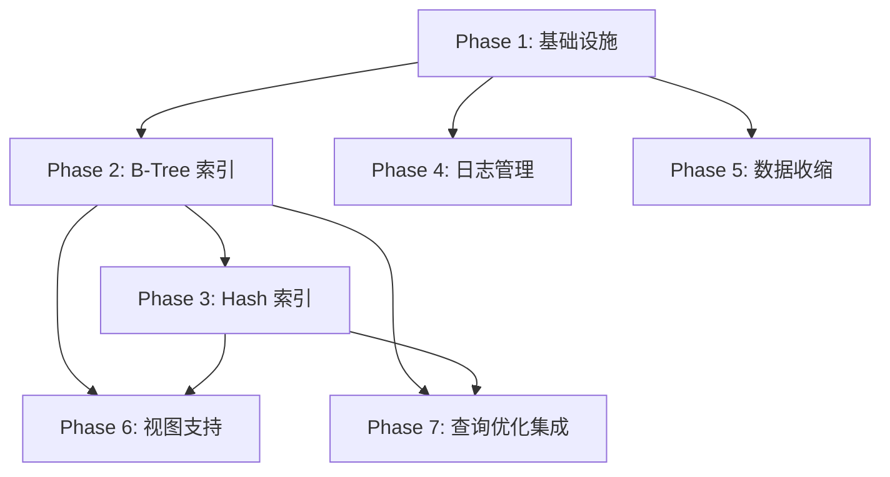

# CyscaleDB 数据库文件强化与索引视图支持计划

## 一、当前状态分析

### 已有基础

- 分页存储引擎（4KB 页面）
- 缓冲池管理（LRU 策略）
- WAL 日志（基础的 ARIES 风格）
- 全表扫描查询执行

### 需要新增

- 索引文件和索引数据结构
- 日志轮转/归档/检查点
- 数据收缩（VACUUM/OPTIMIZE）
- 视图支持

---

## 二、文件系统扩展设计

### 文件类型规划

```
database_name/
├── table_name.cdb          # 数据文件（已有）
├── table_name.idx          # B-Tree 索引文件（新增）
├── table_name.hash         # Hash 索引文件（新增）
├── cyscaledb.wal           # 当前活跃 WAL（已有）
├── cyscaledb.wal.1         # 轮转后的 WAL（新增）
├── cyscaledb.wal.1.gz      # 归档的 WAL（新增）
└── checkpoint.meta         # 检查点信息（新增）
```

### 常量扩展 - [Constants.cs](src/CyscaleDB.Core/Common/Constants.cs)

```csharp
// 新增文件扩展名
public const string IndexFileExtension = ".idx";
public const string HashIndexExtension = ".hash";
public const string CheckpointFileName = "checkpoint.meta";

// WAL 配置
public const long MaxWalFileSize = 16 * 1024 * 1024;  // 16MB
public const int MaxWalFiles = 10;
public const int CheckpointIntervalSeconds = 300;     // 5分钟
```

---

## 三、索引系统设计

### 3.1 索引元数据结构

在 [Storage/](src/CyscaleDB.Core/Storage/) 新建 `IndexInfo.cs`:

```csharp
public record IndexInfo(
    int IndexId,
    string IndexName,
    string TableName,
    string DatabaseName,
    IndexType Type,
    List<string> Columns,
    bool IsUnique,
    bool IsPrimaryKey
);

public enum IndexType { BTree, Hash }
```

### 3.2 B-Tree 索引实现

新建 `Storage/Index/BTreeIndex.cs`:

- 使用磁盘 B+ 树结构
- 页面类型：`PageType.Index`（已有定义）
- 叶子节点存储 (Key, RowId) 对
- 内部节点存储 (Key, ChildPageId) 对
- 支持范围查询：`<`, `<=`, `>`, `>=`, `BETWEEN`

### 3.3 Hash 索引实现

新建 `Storage/Index/HashIndex.cs`:

- 可扩展哈希（Extendible Hashing）
- 适用于等值查询 `=`, `IN`
- 目录页 + 桶页设计

### 3.4 索引管理器

新建 `Storage/Index/IndexManager.cs`:

```csharp
public class IndexManager
{
    // 创建/删除索引
    public void CreateIndex(IndexInfo info);
    public void DropIndex(string dbName, string tableName, string indexName);
    
    // 索引维护（DML 时调用）
    public void InsertKey(IndexInfo index, DataValue[] keyValues, RowId rowId);
    public void DeleteKey(IndexInfo index, DataValue[] keyValues, RowId rowId);
    public void UpdateKey(IndexInfo index, DataValue[] oldKeys, DataValue[] newKeys, RowId rowId);
    
    // 查询
    public IEnumerable<RowId> Lookup(IndexInfo index, DataValue[] keyValues);
    public IEnumerable<RowId> RangeScan(IndexInfo index, DataValue[]? start, DataValue[]? end);
}
```

### 3.5 SQL 语法扩展

在 [Statements.cs](src/CyscaleDB.Core/Parsing/Ast/Statements.cs) 添加:

```csharp
public class CreateIndexStatement : Statement
{
    public string IndexName { get; set; }
    public string TableName { get; set; }
    public string? DatabaseName { get; set; }
    public List<string> Columns { get; set; }
    public IndexType IndexType { get; set; }  // BTREE 或 HASH
    public bool IsUnique { get; set; }
}

public class DropIndexStatement : Statement
{
    public string IndexName { get; set; }
    public string TableName { get; set; }
    public string? DatabaseName { get; set; }
}
```

---

## 四、日志管理增强

### 4.1 日志轮转

修改 [WalLog.cs](src/CyscaleDB.Core/Transactions/WalLog.cs):

```csharp
public class WalLog
{
    // 新增：检查并执行轮转
    private void CheckAndRotate()
    {
        if (_logStream.Length >= Constants.MaxWalFileSize)
            Rotate();
    }
    
    // 轮转到新文件
    private void Rotate()
    {
        Flush();
        _logStream.Close();
        // 重命名 cyscaledb.wal -> cyscaledb.wal.1
        // 创建新的 cyscaledb.wal
    }
}
```

### 4.2 日志归档

新建 `Transactions/WalArchiver.cs`:

```csharp
public class WalArchiver
{
    // 压缩旧日志文件
    public void ArchiveOldLogs(string dataDirectory);
    
    // 清理过期归档
    public void PurgeOldArchives(int retentionDays);
}
```

### 4.3 检查点机制

新建 `Transactions/CheckpointManager.cs`:

```csharp
public class CheckpointManager
{
    // 执行检查点
    public void Checkpoint()
    {
        // 1. 暂停新事务
        // 2. 刷新所有脏页到磁盘
        // 3. 记录检查点 LSN
        // 4. 截断旧日志
    }
    
    // 后台定期检查点
    public void StartPeriodicCheckpoint(TimeSpan interval);
}
```

---

## 五、数据收缩功能

### 5.1 表级收缩 (OPTIMIZE TABLE)

修改 [Table.cs](src/CyscaleDB.Core/Storage/Table.cs):

```csharp
public class Table
{
    // 重组表，回收删除行的空间
    public void Optimize()
    {
        // 1. 扫描所有页面，收集有效行
        // 2. 创建新的临时文件
        // 3. 紧凑写入有效行
        // 4. 替换原文件
        // 5. 重建索引
    }
}
```

### 5.2 数据库级收缩

修改 [StorageEngine.cs](src/CyscaleDB.Core/Storage/StorageEngine.cs):

```csharp
public class StorageEngine
{
    // 收缩数据库
    public void ShrinkDatabase(string databaseName)
    {
        // 对每个表执行 Optimize
        foreach (var table in GetTables(databaseName))
            OptimizeTable(databaseName, table);
        
        // 清理空闲页面
        CompactFreePages();
    }
}
```

### 5.3 SQL 语法

```csharp
public class OptimizeTableStatement : Statement
{
    public string TableName { get; set; }
    public string? DatabaseName { get; set; }
}
```

---

## 六、视图支持

### 6.1 视图元数据

在 [DatabaseInfo.cs](src/CyscaleDB.Core/Storage/DatabaseInfo.cs) 添加:

```csharp
public class ViewInfo
{
    public int ViewId { get; set; }
    public string ViewName { get; set; }
    public string DatabaseName { get; set; }
    public string Definition { get; set; }      // 原始 SQL
    public SelectStatement ParsedQuery { get; set; }  // 解析后的 AST
    public List<string> ColumnNames { get; set; }
}

public class DatabaseInfo
{
    // 新增
    private readonly List<ViewInfo> _views = [];
    public IReadOnlyList<ViewInfo> Views => _views;
    
    public void AddView(ViewInfo view);
    public void RemoveView(string viewName);
    public ViewInfo? GetView(string viewName);
}
```

### 6.2 视图 SQL 语法

在 [Statements.cs](src/CyscaleDB.Core/Parsing/Ast/Statements.cs) 添加:

```csharp
public class CreateViewStatement : Statement
{
    public string ViewName { get; set; }
    public string? DatabaseName { get; set; }
    public List<string>? ColumnNames { get; set; }  // 可选的列别名
    public SelectStatement Query { get; set; }      // AS SELECT ...
    public bool OrReplace { get; set; }             // CREATE OR REPLACE
}

public class DropViewStatement : Statement
{
    public string ViewName { get; set; }
    public string? DatabaseName { get; set; }
    public bool IfExists { get; set; }
}
```

### 6.3 视图查询执行

在 [Executor.cs](src/CyscaleDB.Core/Execution/Executor.cs) 修改:

```csharp
// 在处理 SimpleTableReference 时
private IOperator BuildTableScan(SimpleTableReference tableRef)
{
    // 检查是否是视图
    var view = _catalog.GetView(dbName, tableRef.TableName);
    if (view != null)
    {
        // 展开视图定义
        return BuildSelectPlan(view.ParsedQuery);
    }
    
    // 原有的表扫描逻辑...
}
```

---

## 七、查询优化器集成

### 索引选择逻辑

新建 `Execution/IndexSelector.cs`:

```csharp
public class IndexSelector
{
    // 选择最优索引
    public IndexInfo? SelectIndex(TableSchema table, Expression? whereClause)
    {
        // 分析 WHERE 条件
        // 检查可用索引
        // 评估选择率
        // 返回最优索引或 null（全表扫描）
    }
}
```

### 索引扫描算子

新建 `Execution/Operators/IndexScanOperator.cs`:

```csharp
public class IndexScanOperator : IOperator
{
    // 使用索引进行查询
    // 支持等值查询和范围查询
}
```

---

## 八、修改文件清单

### 新建文件

| 路径 | 说明 |

|------|------|

| `Storage/Index/IndexInfo.cs` | 索引元数据 |

| `Storage/Index/BTreeIndex.cs` | B-Tree 索引实现 |

| `Storage/Index/BTreePage.cs` | B-Tree 页面结构 |

| `Storage/Index/HashIndex.cs` | Hash 索引实现 |

| `Storage/Index/IndexManager.cs` | 索引管理器 |

| `Storage/ViewInfo.cs` | 视图元数据 |

| `Transactions/CheckpointManager.cs` | 检查点管理 |

| `Transactions/WalArchiver.cs` | 日志归档 |

| `Execution/IndexSelector.cs` | 索引选择器 |

| `Execution/Operators/IndexScanOperator.cs` | 索引扫描算子 |

### 修改文件

| 路径 | 修改内容 |

|------|----------|

| `Common/Constants.cs` | 添加索引/日志相关常量 |

| `Storage/DatabaseInfo.cs` | 添加视图存储 |

| `Storage/Table.cs` | 添加 Optimize 方法 |

| `Storage/StorageEngine.cs` | 添加 Shrink 方法 |

| `Storage/Catalog.cs` | 添加索引/视图管理 |

| `Transactions/WalLog.cs` | 添加日志轮转 |

| `Parsing/Ast/Statements.cs` | 添加新语句 AST |

| `Parsing/Parser.cs` | 解析新语法 |

| `Execution/Executor.cs` | 执行新语句 |

---

## 九、实施顺序建议



1. **Phase 1**: 常量定义、文件结构、索引元数据
2. **Phase 2**: B-Tree 索引核心实现
3. **Phase 3**: Hash 索引实现
4. **Phase 4**: 日志轮转、归档、检查点
5. **Phase 5**: OPTIMIZE TABLE 和数据库收缩
6. **Phase 6**: 视图 CREATE/DROP/查询
7. **Phase 7**: 查询优化器索引选择

---

## 十、测试计划

- 为每个新功能编写单元测试
- 索引正确性测试（插入、删除、查找）
- 日志恢复测试
- 数据收缩后数据完整性测试
- 视图查询正确性测试
- 性能对比测试（全表扫描 vs 索引扫描）